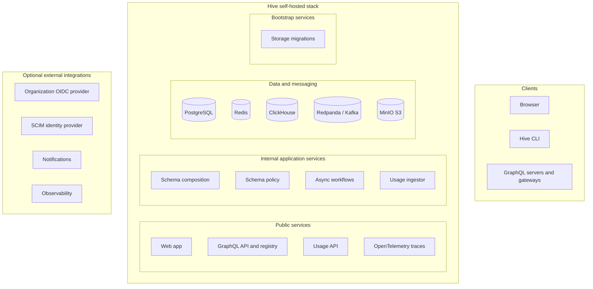
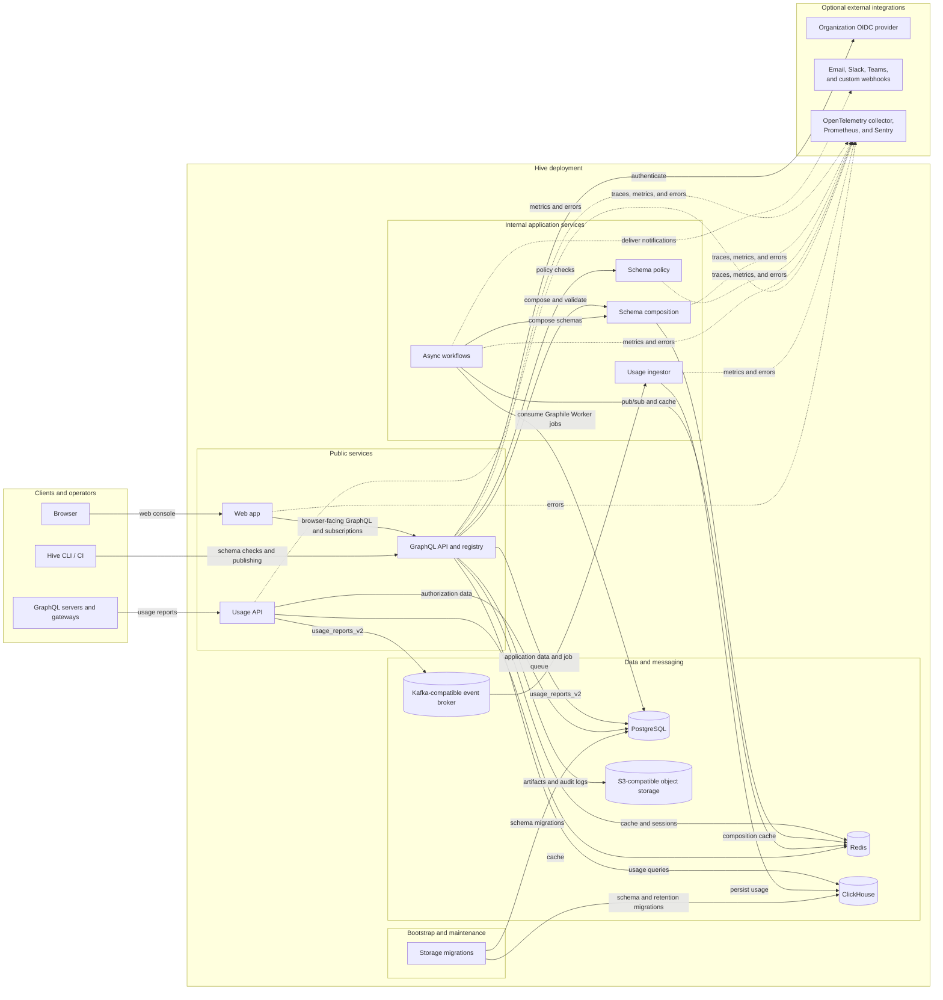

# Architecture

## Self-Hosted Architecture

The diagram below represents the Hive core services in
[`docker-compose.community.yml`](../docker/docker-compose.community.yml). Cloud-only services such
as billing, the Cloudflare CDN and request broker, and managed infrastructure are not part of the
self-hosted stack.

### High-Level Overview

### Detailed Interactions

PostgreSQL, Redis, ClickHouse, Redpanda, and MinIO persist their data under `docker/.hive/` by
default. MinIO exposes its API and administration console directly in addition to the Caddy reverse
proxy. Redpanda also publishes its Kafka listener on port `9092` and metrics/admin endpoint on port
`9644`.

The observability integrations are optional. The community Compose file does not run an
OpenTelemetry collector, Prometheus, or Sentry; operators provide and configure these externally.
