# ClickHouse Schema

This diagram shows the current ClickHouse schema after all registered migrations have completed. An
arrow represents the insert flow from a materialized view's `SELECT` source to the view and, when
the view has a `TO` clause, from the view to its destination table.

Materialized views marked **internal storage** define their own table engine. ClickHouse stores
their results in generated `.inner_id.*` tables, which are intentionally omitted because their names
are not stable application schema.

```mermaid
flowchart LR
  subgraph sources[Source tables]
    operations[(operations)]
    operation_collection[(operation_collection)]
    subscription_operations[(subscription_operations)]
    operation_errors[(operation_errors)]
    otel_traces[(otel_traces)]
    app_deployment_documents[(app_deployment_documents)]
  end

  subgraph operation_views[Operation aggregates with internal storage]
    operations_minutely["operations_minutely<br/>MV + internal storage"]
    operations_hourly["operations_hourly<br/>MV + internal storage"]
    operations_daily["operations_daily<br/>MV + internal storage"]
    clients_minutely["clients_minutely<br/>MV + internal storage"]
    clients_hourly["clients_hourly<br/>MV + internal storage"]
    clients_daily["clients_daily<br/>MV + internal storage"]
    target_existence["target_existence<br/>MV + internal storage"]
  end

  subgraph collection_views[Operation collection views with internal storage]
    coordinates_minutely["coordinates_minutely<br/>MV + internal storage"]
    coordinates_hourly["coordinates_hourly<br/>MV + internal storage"]
    coordinates_daily["coordinates_daily<br/>MV + internal storage"]
    operation_collection_body["operation_collection_body<br/>MV + internal storage"]
    operation_collection_details["operation_collection_details<br/>MV + internal storage"]
  end

  subgraph subscription_views[Subscription views with internal storage]
    subscription_operations_daily["subscription_operations_daily<br/>MV + internal storage"]
    subscription_target_existence["subscription_target_existence<br/>MV + internal storage"]
  end

  subgraph overview[Overview tables]
    monthly_overview_operations[monthly_overview_operations MV]
    monthly_overview_subscriptions[monthly_overview_subscriptions MV]
    monthly_overview[(monthly_overview)]
    daily_overview_operations[daily_overview_operations MV]
    daily_overview_subscriptions[daily_overview_subscriptions MV]
    daily_overview[(daily_overview)]
  end

  subgraph target_rollups[Target metric rollups]
    operations_by_target_minutely_mv[operations_by_target_minutely_mv]
    operations_by_target_minutely[(operations_by_target_minutely)]
    operations_by_target_hourly_mv[operations_by_target_hourly_mv]
    operations_by_target_hourly[(operations_by_target_hourly)]
    operations_by_target_daily_mv[operations_by_target_daily_mv]
    operations_by_target_daily[(operations_by_target_daily)]
  end

  subgraph coordinate_counts[Coordinate count pipeline]
    mv_coordinate_counts_minutely[mv_coordinate_counts_minutely]
    coordinate_counts_minutely[(coordinate_counts_minutely)]
    mv_coordinate_counts_hourly[mv_coordinate_counts_hourly]
    coordinate_counts_hourly[(coordinate_counts_hourly)]
    mv_coordinate_counts_daily[mv_coordinate_counts_daily]
    coordinate_counts_daily[(coordinate_counts_daily)]
    mv_target_field_level_metrics_onboard_timestamp[mv_target_field_level_metrics_onboard_timestamp]
    target_field_level_metrics_onboard_timestamp[(target_field_level_metrics_onboard_timestamp)]
  end

  subgraph coordinate_errors[Coordinate error pipeline]
    mv_coordinate_errors_minutely[mv_coordinate_errors_minutely]
    coordinate_errors_minutely[(coordinate_errors_minutely)]
    mv_coordinate_errors_hourly[mv_coordinate_errors_hourly]
    coordinate_errors_hourly[(coordinate_errors_hourly)]
    mv_coordinate_errors_daily[mv_coordinate_errors_daily]
    coordinate_errors_daily[(coordinate_errors_daily)]
  end

  subgraph tdigest_rollups[Operation TDigest rollups]
    operations_tdigest_minutely_mv[operations_tdigest_minutely_mv]
    operations_tdigest_minutely[(operations_tdigest_minutely)]
    operations_tdigest_hourly_mv[operations_tdigest_hourly_mv]
    operations_tdigest_hourly[(operations_tdigest_hourly)]
    operations_tdigest_daily_mv[operations_tdigest_daily_mv]
    operations_tdigest_daily[(operations_tdigest_daily)]
    clients_tdigest_minutely_mv[clients_tdigest_minutely_mv]
    clients_tdigest_minutely[(clients_tdigest_minutely)]
    clients_tdigest_hourly_mv[clients_tdigest_hourly_mv]
    clients_tdigest_hourly[(clients_tdigest_hourly)]
    clients_tdigest_daily_mv[clients_tdigest_daily_mv]
    clients_tdigest_daily[(clients_tdigest_daily)]
  end

  subgraph traces[OpenTelemetry traces]
    otel_traces_trace_id_ts_mv[otel_traces_trace_id_ts_mv]
    otel_traces_trace_id_ts[(otel_traces_trace_id_ts)]
    otel_traces_normalized_mv[otel_traces_normalized_mv]
    otel_traces_normalized[(otel_traces_normalized)]
  end

  subgraph deployments[App deployments]
    app_deployments[(app_deployments)]
    mv_documents_by_coordinate[mv_documents_by_coordinate]
    app_deployment_document_coordinates[(app_deployment_document_coordinates)]
    app_deployment_usage[(app_deployment_usage)]
  end

  subgraph standalone[Standalone tables]
    migrations[(migrations)]
    audit_logs[(audit_logs)]
  end

  operations --> operations_minutely
  operations --> operations_hourly
  operations --> operations_daily
  operations --> clients_minutely
  operations --> clients_hourly
  operations --> clients_daily
  operations --> target_existence

  operation_collection --> coordinates_minutely
  operation_collection --> coordinates_hourly
  operation_collection --> coordinates_daily
  operation_collection --> operation_collection_body
  operation_collection --> operation_collection_details

  subscription_operations --> subscription_operations_daily
  subscription_operations --> subscription_target_existence

  operations --> monthly_overview_operations --> monthly_overview
  subscription_operations --> monthly_overview_subscriptions --> monthly_overview
  operations --> daily_overview_operations --> daily_overview
  subscription_operations --> daily_overview_subscriptions --> daily_overview

  operations --> operations_by_target_minutely_mv --> operations_by_target_minutely
  operations --> operations_by_target_hourly_mv --> operations_by_target_hourly
  operations --> operations_by_target_daily_mv --> operations_by_target_daily

  operations --> mv_coordinate_counts_minutely --> coordinate_counts_minutely
  coordinate_counts_minutely --> mv_coordinate_counts_hourly --> coordinate_counts_hourly
  coordinate_counts_hourly --> mv_coordinate_counts_daily --> coordinate_counts_daily
  operations --> mv_target_field_level_metrics_onboard_timestamp --> target_field_level_metrics_onboard_timestamp

  operation_errors --> mv_coordinate_errors_minutely --> coordinate_errors_minutely
  coordinate_errors_minutely --> mv_coordinate_errors_hourly --> coordinate_errors_hourly
  coordinate_errors_hourly --> mv_coordinate_errors_daily --> coordinate_errors_daily

  operations --> operations_tdigest_minutely_mv --> operations_tdigest_minutely
  operations --> operations_tdigest_hourly_mv --> operations_tdigest_hourly
  operations --> operations_tdigest_daily_mv --> operations_tdigest_daily
  operations --> clients_tdigest_minutely_mv --> clients_tdigest_minutely
  operations --> clients_tdigest_hourly_mv --> clients_tdigest_hourly
  operations --> clients_tdigest_daily_mv --> clients_tdigest_daily

  otel_traces --> otel_traces_trace_id_ts_mv --> otel_traces_trace_id_ts
  otel_traces --> otel_traces_normalized_mv --> otel_traces_normalized

  app_deployment_documents --> mv_documents_by_coordinate --> app_deployment_document_coordinates

  classDef table fill:#e8f1ff,stroke:#2457a6,stroke-width:2px,color:#10233f
  classDef materializedView fill:#fff4d6,stroke:#9a6700,stroke-width:2px,color:#3d2b00
  classDef internalView fill:#f4e8ff,stroke:#7040a0,stroke-width:2px,color:#2d1745

  class operations,operation_collection,subscription_operations,operation_errors,otel_traces,app_deployment_documents,monthly_overview,daily_overview,operations_by_target_minutely,operations_by_target_hourly,operations_by_target_daily,coordinate_counts_minutely,coordinate_counts_hourly,coordinate_counts_daily,target_field_level_metrics_onboard_timestamp,coordinate_errors_minutely,coordinate_errors_hourly,coordinate_errors_daily,operations_tdigest_minutely,operations_tdigest_hourly,operations_tdigest_daily,clients_tdigest_minutely,clients_tdigest_hourly,clients_tdigest_daily,otel_traces_trace_id_ts,otel_traces_normalized,app_deployments,app_deployment_document_coordinates,app_deployment_usage,migrations,audit_logs table
  class monthly_overview_operations,monthly_overview_subscriptions,daily_overview_operations,daily_overview_subscriptions,operations_by_target_minutely_mv,operations_by_target_hourly_mv,operations_by_target_daily_mv,mv_coordinate_counts_minutely,mv_coordinate_counts_hourly,mv_coordinate_counts_daily,mv_target_field_level_metrics_onboard_timestamp,mv_coordinate_errors_minutely,mv_coordinate_errors_hourly,mv_coordinate_errors_daily,operations_tdigest_minutely_mv,operations_tdigest_hourly_mv,operations_tdigest_daily_mv,clients_tdigest_minutely_mv,clients_tdigest_hourly_mv,clients_tdigest_daily_mv,otel_traces_trace_id_ts_mv,otel_traces_normalized_mv,mv_documents_by_coordinate materializedView
  class operations_minutely,operations_hourly,operations_daily,clients_minutely,clients_hourly,clients_daily,target_existence,coordinates_minutely,coordinates_hourly,coordinates_daily,operation_collection_body,operation_collection_details,subscription_operations_daily,subscription_target_existence internalView
```

The graph includes 31 persistent tables and 37 materialized views in the registered migration end
state. It excludes temporary migration tables and views, objects removed by later migrations, and
schemas that only appear in design documents. In particular, `otel_subgraph_spans` and
`otel_subgraph_spans_mv` are removed by migration 016.
