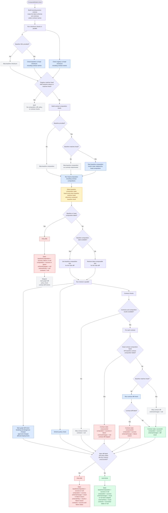

# Composite Schema Check Business Logic Breakdown

```mermaid
flowchart TD
    Start([CompositeModel.check]) --> Prepare["Build incoming service schema<br/>swap into latest schemas<br/>sort schemas<br/>collect contract names"]

    Prepare --> Checksums["Run checksum checks in parallel"]
    Checksums --> BaselineChecksum{"Baseline SDL provided?"}
    BaselineChecksum -- No --> SkipBaselineChecksum["Skip baseline checksum"]
    BaselineChecksum -- Yes --> RunBaselineChecksum["Check baseline vs head checksum<br/>including contract names"]

    Checksums --> RegistryChecksum["Check registry vs head checksum<br/>including contract names"]

    SkipBaselineChecksum --> FullSkip
    RunBaselineChecksum --> FullSkip
    RegistryChecksum --> FullSkip

    FullSkip{"Registry matches head<br/>AND baseline absent or matches head?"}
    FullSkip -- Yes --> StateSkip["SKIP<br/>No composition, diff, policy,<br/>or contract checks"]
    FullSkip -- No --> ContractInput["Build contract composition inputs"]

    ContractInput --> HasBaseline{"Baseline provided?"}
    HasBaseline -- No --> NoBaselineComposition["Skip baseline composition"]
    HasBaseline -- Yes --> BaselineMatches{"Baseline matches head?"}

    %% This reflects the current implementation in composite.ts.
    BaselineMatches -- No --> SkipBaselineComposition["Skip baseline composition<br/>as currently implemented"]
    BaselineMatches -- Yes --> StartBaselineComposition["Start baseline composition<br/>result is later replaced by head composition"]

    NoBaselineComposition --> HeadComposition
    SkipBaselineComposition --> HeadComposition
    StartBaselineComposition --> HeadComposition

    HeadComposition["Run head composition<br/>including contract compositions"] --> SelectBaselineState["Select baseline composition state:<br/>head result when baseline matches head;<br/>otherwise composed baseline result"]

    SelectBaselineState --> CompositionFailure{"Baseline or head<br/>composition failed?"}

    CompositionFailure -- Yes --> EarlyFailure["FAILURE"]
    EarlyFailure --> EarlyFailureState["State:<br/>baselineComposition = success, failure, or null<br/>composition = success or failure<br/>schemaChanges = null<br/>schemaPolicy = null<br/>contracts = null"]
    EarlyFailureState --> EarlySkipped["Skipped:<br/>main graph diff<br/>policy check<br/>contract diff checks"]

    CompositionFailure -- No --> ExistingSDL{"Baseline composition<br/>state available?"}
    ExistingSDL -- Yes --> UseBaselineSDL["Use baseline composition SDL<br/>for the main diff"]
    ExistingSDL -- No --> RetrieveSDL["Retrieve latest composable SDL<br/>for the main diff"]

    UseBaselineSDL --> ParallelChecks
    RetrieveSDL --> ParallelChecks

    ParallelChecks["Run checks in parallel"] --> MainDiff["Main graph diff check<br/>breaking and dangerous changes<br/>approved changes<br/>affected deployments"]
    ParallelChecks --> PolicyCheck["Schema policy check"]
    ParallelChecks --> ContractChecks["Contract checks"]

    ContractChecks --> ContractData{"Contracts and composition<br/>results available?"}
    ContractData -- No --> NoContractChecks["Skip contract checks<br/>contracts = null"]
    ContractData -- Yes --> EachContract["For each contract"]

    EachContract --> ContractComposition{"Head contract composition failed<br/>OR baseline contract composition failed?"}
    ContractComposition -- Yes --> ContractCompositionFailure["Contract state: unsuccessful<br/>composition = success or failure<br/>schemaChanges = null<br/>contract diff skipped"]

    ContractComposition -- No --> ContractDiffChoice{"Baseline matches head?"}
    ContractDiffChoice -- Yes --> SkipContractDiff["Skip contract diff<br/>schemaChanges = null"]
    ContractDiffChoice -- No --> ContractDiff["Run contract diff check"]

    ContractDiff --> ContractDiffFailed{"Contract diff failed?"}
    ContractDiffFailed -- Yes --> ContractDiffFailure["Contract state: unsuccessful<br/>composition = success<br/>schemaChanges = failure reason"]
    ContractDiffFailed -- No --> ContractSuccess["Contract state: successful<br/>composition = success<br/>schemaChanges = diff result"]

    SkipContractDiff --> ContractSuccess

    MainDiff --> FinalDecision
    PolicyCheck --> FinalDecision
    NoContractChecks --> FinalDecision
    ContractCompositionFailure --> FinalDecision
    ContractDiffFailure --> FinalDecision
    ContractSuccess --> FinalDecision

    FinalDecision{"Main diff failed<br/>OR policy failed<br/>OR any contract unsuccessful?"}

    FinalDecision -- Yes --> StateFailure["FAILURE"]
    StateFailure --> FailureState["State:<br/>baselineComposition = success or null<br/>composition = success<br/>schemaChanges = result or failure reason<br/>schemaPolicy = result or failure reason<br/>contracts = success and failure states"]

    FinalDecision -- No --> StateSuccess["SUCCESS"]
    StateSuccess --> SuccessState["State:<br/>baselineComposition = success or null<br/>composition = success<br/>schemaChanges = result or null when skipped<br/>schemaPolicy = result<br/>contracts = successful states or null"]

    classDef check fill:#dbeafe,stroke:#2563eb,color:#172554
    classDef skipped fill:#f3f4f6,stroke:#6b7280,color:#374151,stroke-dasharray:5 5
    classDef success fill:#dcfce7,stroke:#16a34a,color:#14532d
    classDef failure fill:#fee2e2,stroke:#dc2626,color:#7f1d1d
    classDef warning fill:#fef3c7,stroke:#d97706,color:#78350f

    class RunBaselineChecksum,RegistryChecksum,HeadComposition,StartBaselineComposition,MainDiff,PolicyCheck,ContractDiff check
    class StateSkip,SkipBaselineChecksum,SkipBaselineComposition,NoBaselineComposition,SkipContractDiff,NoContractChecks,EarlySkipped skipped
    class StateSuccess,SuccessState,ContractSuccess success
    class EarlyFailure,EarlyFailureState,StateFailure,FailureState,ContractCompositionFailure,ContractDiffFailure failure
    class SelectBaselineState warning
```
