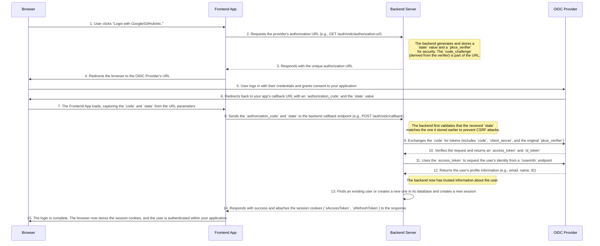
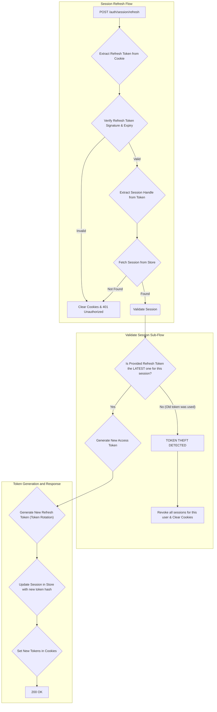

# Supertokens Implementation Notes

This file contains some useful information regarding the supertokens implementation.

## OIDC/Social Provider Login Flow



## Refresh Session Flow



### Refresh Session Security

This section goes a bit into detail on how token theft is prevented.

The mechanism relies on a "chained" or "linked" token system, where each new refresh token is
cryptographically linked to the one that came before it. The server only needs to store a single
hash to validate the entire chain.

#### The Key Components

1.  **The Refresh Token Payload**: When a new refresh token is created, it contains a special field
    called `parentRefreshTokenHash1`. This field holds a SHA256 hash of the _previous_ refresh token
    that was used. The very first refresh token in a session will not have this field.

2.  **The Session Store (Database)**: The server does not store the raw refresh tokens. Instead, for
    each session, it stores a value called `refreshTokenHash2`. This is the hash of the **latest and
    currently valid** refresh token that has been issued to the client.

#### The Validation Process

When a client sends a request to `/auth/session/refresh`, the server performs the following checks,
which you can see in the `supertokens-at-home.ts` file around lines 499-509:

```ts
if (
  !payload.parentRefreshTokenHash1 &&
  sha256(sha256(refreshToken)) !== session.refreshTokenHash2
) {
  req.log.debug('The refreshTokenHash2 does not match (first refresh).');
  return unsetAuthCookies(rep).status(404).send();
}

if (
  payload.parentRefreshTokenHash1 &&
  session.refreshTokenHash2 !== sha256(payload.parentRefreshTokenHash1)
) {
```

##### Scenario 1: The Very First Refresh

- **Condition**: The incoming refresh token's payload **does not** contain a
  `parentRefreshTokenHash1`.
- **Action**: The server knows this must be the original refresh token created at login. To verify
  it, it performs a double SHA256 hash on the raw token (`sha256(sha256(refreshToken))`) and
  compares it to the `refreshTokenHash2` stored in the session.
- **Result**: If they match, the token is valid. If not, the request is rejected.

##### Scenario 2: All Subsequent Refreshes

- **Condition**: The incoming refresh token's payload **does** contain a `parentRefreshTokenHash1`.
- **Action**: This is the crucial step for detecting token reuse. The server takes the
  `parentRefreshTokenHash1` from the payload, hashes it once
  (`sha256(payload.parentRefreshTokenHash1)`), and compares it to the `refreshTokenHash2` from the
  session store.
- **Result**:
  - **Match**: This proves that the token used to generate the _current_ token was the latest one
    known to the server. The session is valid.
  - **Mismatch**: This is the **token theft** scenario. It means that the `refreshTokenHash2` in the
    database is newer than the one being presented. This can only happen if an older, already used
    token has been submitted. The request is immediately rejected.

### The "Rotation": Updating the Hash

If the validation is successful, the server generates a _new_ refresh token and then immediately
updates the session in the database. The `refreshTokenHash2` is replaced with a new hash derived
from the refresh token that was just used.

This ensures that for the next refresh cycle, only the newly issued refresh token will be considered
valid, continuing the chain and maintaining security.
