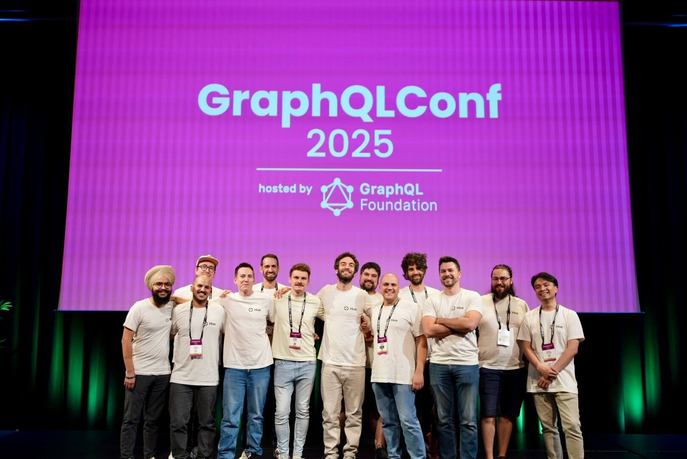
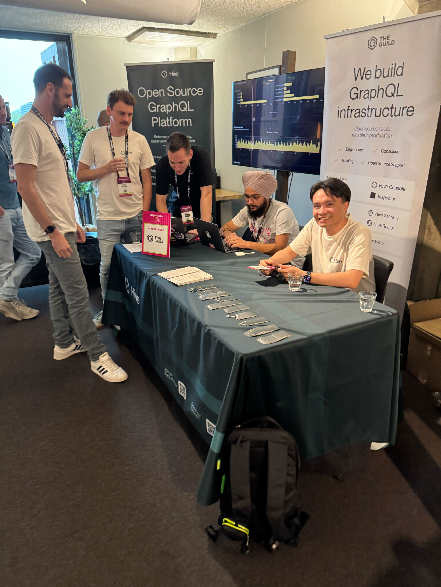
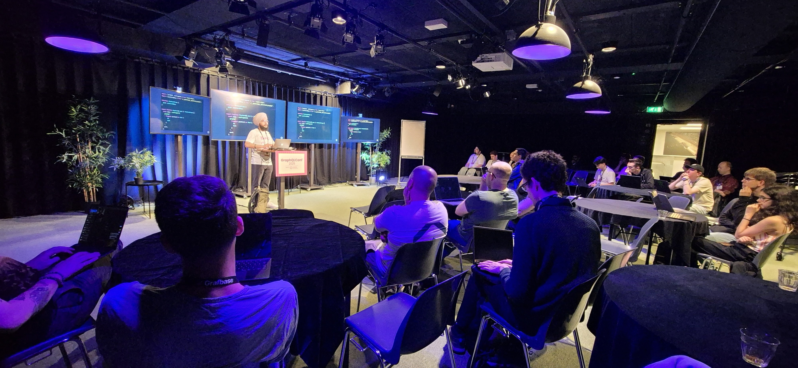

Another year, another successful GraphQL Conference — this time hosted for the first time in the
Netherlands, in Amsterdam! The community came together once again, this time to celebrate **10 years
of GraphQL**.

Over three packed days, attendees enjoyed workshops on real-world solutions, case studies from
companies betting big on GraphQL, and deep, exciting talks from industry veterans and thought
leaders. Everyone who cares about GraphQL and its ecosystem was there.

> Picture by [Taz Singh](https://x.com/tazsingh)

From FAANG engineers sharing their experiences at scale, to businesses of all sizes presenting their
success stories, to GraphQL Working Group members tackling complex problems face-to-face—it was a
program that could make any GraphQL enthusiast happy.

As always, it was a great opportunity to finally meet the people behind those outdated GitHub
avatars—the driving force of this vibrant community.

We exchanged ideas, learned about different ways GraphQL is used, and saw firsthand a diverse and
healthy ecosystem where many solutions and vendors can thrive — whether through a federated approach
or a monolith.

And of course, there were a ton of announcements!

## Big Announcements

- 🎉 After years, the brand-new [graphql.org](http://graphql.org/) website was launched at the
  conference—which we were proud to help build.
- 📜 A [new GraphQL Spec version](https://graphql.org/blog/2025-09-08-september-edition/) is here!
  Countless contributors made this possible. Among the quality-of-life improvements (like schema
  coordinates and document descriptions), the highlight is the `@oneOf` directive for input
  objects—finally enabling input unions. Huge milestone!
- 🚀 We launched [Hive Router](https://the-guild.dev/graphql/hive/blog/welcome-hive-router), our
  high-performance federation router built in Rust. We even published
  [a benchmark comparing all available solutions](https://the-guild.dev/graphql/hive/federation-gateway-performance).
  The feedback has been phenomenal, and we’re excited to polish it for production use.
- ⚡ We also released [Hive Gateway v2](https://the-guild.dev/graphql/hive/blog/hive-gateway-v2),
  our JavaScript federation gateway—packed with exciting new features like
  [improved OpenTelemetry support](https://the-guild.dev/graphql/hive/blog/opentelemetry-gateway-v2),
  event-driven federated subscriptions (EDFS), better logging, and intelligent request
  deduplication. The
  [extensive workshop](https://graphql.org/conf/2025/schedule/6fbc71a3ad13189339d753cb078ec781) led
  by Denis Badurina and Arda Tanrıkulu showcased how feature-rich, mature, and easy it is to build a
  federation gateway for your subgraphs.
- 🛠️ Finally, we shipped a
  [new major version of GraphQL Code Generator](https://the-guild.dev/graphql/hive/blog/graphql-code-generator-update-202509),
  massively improving the developer experience for building federated GraphQL servers.
  [Eddy Nguyen shared how to use the server preset in a session at the conference](https://graphql.org/conf/2025/schedule/0281a72e8e35f07c74a5815c42c64a02).

We had a blast at our booth — diving into technical discussions, exchanging ideas, or just chatting
and having fun with the amazing developers who came by.

## Key Takeaways

Let's highlight and reflect a bit on the main takeaways from talking with various folks and
attending sessions and workshops loaded with knowledge.

### Federation is going strong

Federation adoption keeps accelerating.

What used to be a space with a single dominant router now has a thriving ecosystem of open-source,
feature-rich, high-performance alternatives.

Our embeddable query planner will hopefully help teams bridge the gap and skip many of the
[pitfalls we encountered while implementing federation](https://graphql.org/conf/2025/schedule/1a0475a575803503fce927f22dd1beae).

Vendors such as Apollo, Grafbase, and ourselves were present, allowing people to get an overview of
the most widely adopted solutions today.

Major companies are also investing in building and open-sourcing their own solutions, such as the
Kotlin implementation
[presented by Expedia in their session](https://graphql.org/conf/2025/schedule/cb0e7d61d4055d199e7b9040617c2f88/).

Companies like Booking.com
[shared their migration story from a monolith to federation](https://graphql.org/conf/2025/schedule/0296c34928a818353f1568775e47b47a).

Federation is no longer tied to a single language — developers from many ecosystems are federating
in the languages they love.

The Composite Schema Working Group is steadily making progress on creating a shared specification
that vendors and federation users can agree on and build upon, leading us to an interoperable
future. Michael gave us a
[live demo of what to expect in the future](https://graphql.org/conf/2025/schedule/3b8701f24da2cf5456ffd5b793836ace).

On top of that, we also saw innovation from companies like Airbnb that
[reimagine building monoliths in a federated way with Viaduct](https://graphql.org/conf/2025/schedule/eb8343e5935fbfccaaacf983ef84ab49).

### GraphQL Fragments in the spotlight

This year, **GraphQL Fragments finally had their moment in the spotlight**.

> “They are for describing UI component data dependencies, not for re-use!”

Teams are increasingly adopting fragments to build reusable UI components, and lots of best
practices were shared. While Meta developers have long relied on this approach — as showcased by
Janette Cheng in her session on
[“How to use Fragments”](https://graphql.org/conf/2025/schedule/95c83506420d9a9a3a971a8802ba96f8) —
we’re thrilled to see it gain traction across the broader community. It was great to hear other
companies’ success stories about scaling UI and components with Fragments, such as Gabriel
Cura-Castro’s session
[“Building Federated Component Systems That Scale”](https://graphql.org/conf/2025/schedule/4d43e71c77159a2cdfea61b076428a8f),
which also brought in the federation aspect.

With Relay, Apollo, and the
[GraphQL Code Generator client preset](https://the-guild.dev/graphql/hive/blog/unleash-the-power-of-fragments-with-graphql-codegen),
developers now have powerful tooling to build efficient, reusable UI components.

### Fullstack Innovation

We all know the veteran clients: **Relay** and **Apollo**. Relay showed off new features solving
problems at Meta scale, such as
[how to roll out strict error handling](https://graphql.org/conf/2025/schedule/bca05d46cfc531aeb3cd84927f6483c1).
Apollo is
[catching up on feature parity with proven patterns like fragment data masking](https://graphql.org/conf/2025/schedule/efe5aee612551209ba413d57d3ddbb4e).

But fresh projects are also pushing boundaries:

- **Houdini GraphQL** has proven itself in the Svelte community, offering an opinionated, end-to-end
  fullstack GraphQL experience.
  [Alec Aivazis was on stage to share the concepts behind it](https://graphql.org/conf/2025/schedule/dda1fbb70f8b5b73223a6e37a736e5bd).
- **Isograph**, while more controversial, wowed the crowd with its bold ideas — even breaking some
  established GraphQL syntax.
  [Robert Balicki’s live demo of Isograph](https://graphql.org/conf/2025/schedule/a2bb7f46355a46dcab47d654c9ccbe4e)
  was hands-down one of the most entertaining and impressive moments of the conference.
- **Graffle**, a modular and type-safe GraphQL client, was presented in a
  [hands-on demonstration by Jason](https://graphql.org/conf/2025/schedule/ce3c04db5c598ba5451fcd71df4849ee).

It’s inspiring to see new projects experimenting and gaining adoption.

### Errors and Nullability

The Nullability Working Group is making big strides in improving error handling.

Right now, when you see `null` in a GraphQL response, it could mean:

- ✅ A field is _intentionally_ null (e.g., `middleName` doesn’t exist).
- ❌ Something went wrong (resolver error, permissions issue, downstream failure, etc.).

This ambiguity has long been a pain point. Removing it will make GraphQL responses clearer, safer,
and easier to work with — for both API designers and client developers.

Different approaches were discussed, and we’re eager to see how community feedback will shape the
spec.

Working group veteran Benjie shared
[how we can further improve in this space](https://graphql.org/conf/2025/schedule/4ed67778faddda05ce0a191e525d43ee).

In addition, Jeff showcased how to model expected errors as part of the GraphQL schema and
[demonstrated best practices and approaches for designing scalable, future-proof APIs](https://graphql.org/conf/2025/schedule/9e816cd378c96b466658842ef0900183).

### Public GraphQL APIs

Everyone is now using persisted documents or trusted documents, with the exception of those
adventurous teams tackling the challenge of launching public GraphQL APIs. Whether it is Buffer
[rebuilding their public API in GraphQL](https://graphql.org/conf/2025/schedule/e6262da79f7c90fd01a2a13570d6b6bc),
[monday.com tackling the challenge of documenting their API with AI tools](https://graphql.org/conf/2025/schedule/ed1b84b384c39fd16cbba908aeeda283),
or us building and releasing our own
[GraphQL API for our Schema Registry and Federation Platform product Hive Console](https://graphql.org/conf/2025/schedule/11ee2487ca4b81120d1d7218b13f2003),
more and more people are exploring GraphQL as a tool and entry point for third-party API consumers
and businesses.

Tools like
[Pollen help bridge the gap between introspection documentation provided by tools like GraphiQL and handcrafted documentation](https://graphql.org/conf/2025/schedule/6c9b846e538e001af3db938d771d1178).
The need for better tooling to monitor and analyze API usage is becoming more evident.

New problems are also emerging, such as how to deprecate and remove unused fields over time. In this
space, schema registries and analytics platforms like our Hive Console can unleash their true
potential. Rick Bijkerk showcased
[how they automated schema cleanup using Hive Console in his lightning talk](https://graphql.org/conf/2025/schedule/b22c4cbb4356649d15129696322b6777).

We are super excited to see more organizations joining the ranks of GitHub, Shopify, and monday.com
in the public GraphQL API space.

## Closing Thoughts

What a ride!

As always, we’re grateful to be part of this amazing community. GraphQL Conf 2025 was a fantastic
celebration of 10 years of progress, collaboration, and innovation.

We can’t wait to see everyone again next year!
