GraphQL provides many benefits over other query languages. Federation builds on top of this
foundation to provide even more flexibility and power. But even with all that GraphQL has to offer,
API design remains difficult.

Over time, we've developed some proven design philosophies and patterns for easier schema
migrations, exposing errors, and avoiding ambiguous or misleading type names.

## Schema Design Goals and Solutions

As you design your schema, keep in mind that:

> You can and should future proof your schemas as much as possible, but it’s okay for the schema not
> to be perfect. Products change, requirements change. There will be chaos. But if we can tend to
> our schemas, we can encourage them to grow and evolve organically -- much like a garden.

To better tend to our schemas, we can design with some goals in mind, follow some battle tested
patterns, and approach type creation methodically.

### Flexible

The first goal is for your schema to be easy to change over time. As I mentioned before, entropy is
a constant.

And if you anticipate and prepare for change then you can more easily adapt your schema to fit the
needs of your consumers.

---

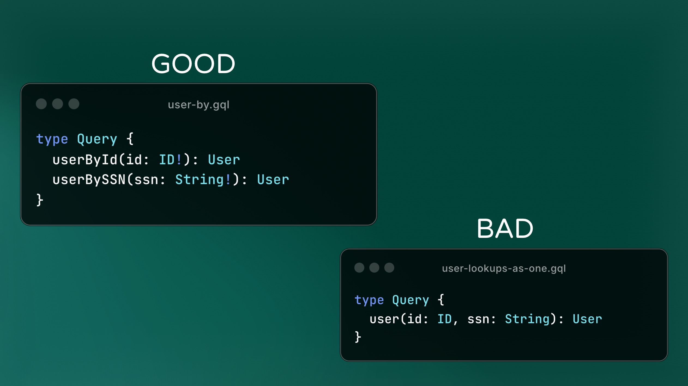

It may be unintuitive, but keeping your field arguments concise and inflexible is one way to help
keep your schema as a whole more flexible.

So don’t overload your arguments or an input type with a bunch of optional ways of doing things. By
keeping fields more focused, we limit the impact that any one change can have. And if we do need to
break things, the blast radius to your API consumers is much smaller.

---

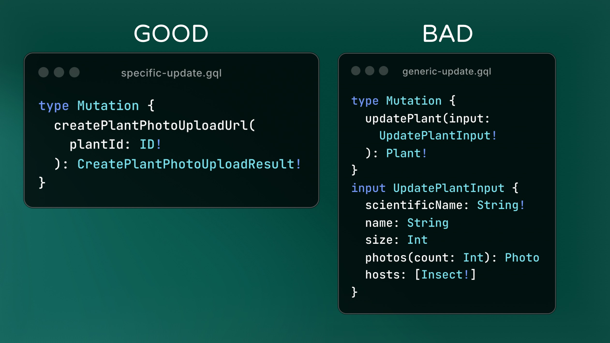

Overloading arguments can also hurt performance by requiring your resolver to do many more things
before returning.

So it’s best to keep your mutations focused on a specific task.

---

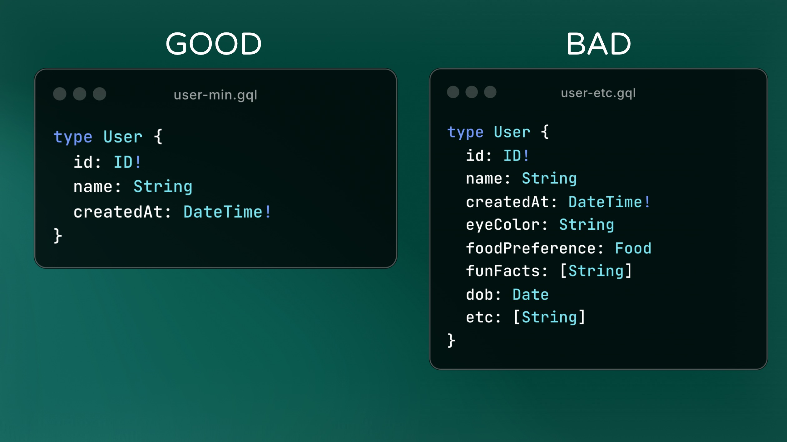

Here we have two examples of User types, but on the left is only what your consumer NEEDS, and on
the right maybe is everything you know about a user. It should be obvious that the left is much
easier to maintain.

Unnecessary fields often go unused or worse, they may cause technical debt because the format of the
data ends up needing changes because it doesn't fit with the new requirements.

---

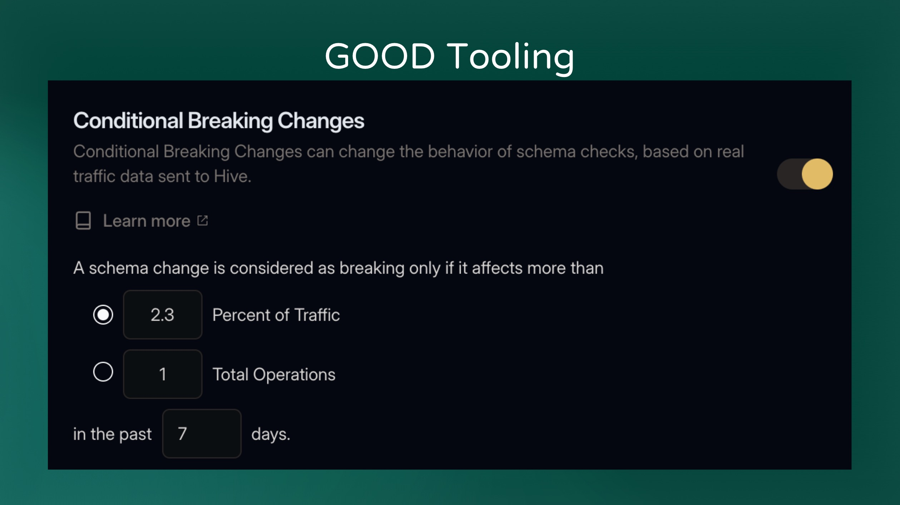

Tooling such as Hive Console can also help. We offer a feature called “Conditional Breaking Changes”
that checks usage data on breaking changes. And if the portion of the schema that broke isn’t used,
then the change is allowed. Otherwise the change is still flagged as breaking.

This lets you safely migrate your schema and eliminates the need to manually check usage when making
breaking changes.

### Accessible & Efficient

Another goal is that traversing the graph should be quick – with as few hops as reasonably possible.

This makes the API more client friendly and reduces strain on your system from too many lookups or
connections.

---

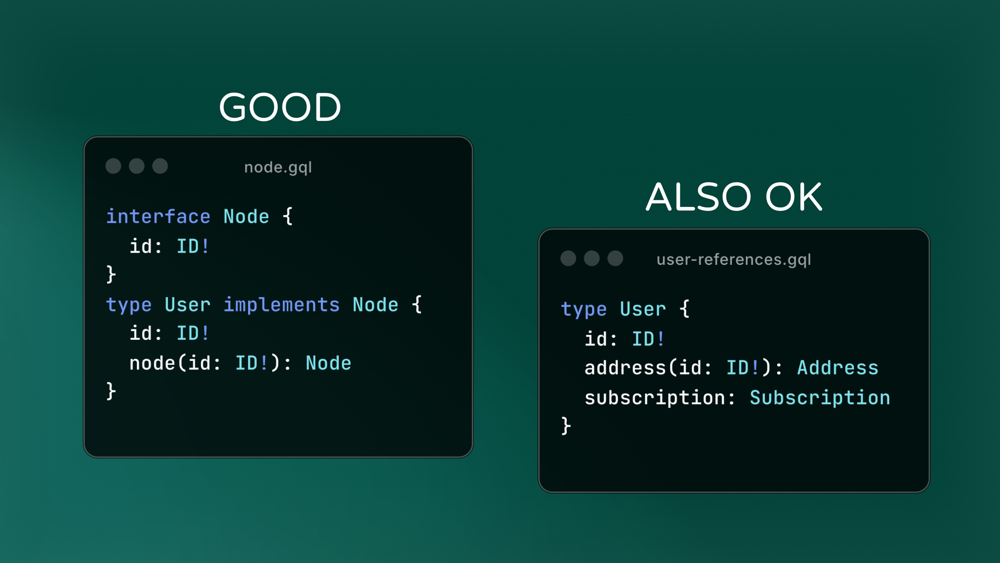

A proven way of doing this is by using a common “Node” interface for every entity type. But so long
as you expose a way to access related types, then that's what's important.

---

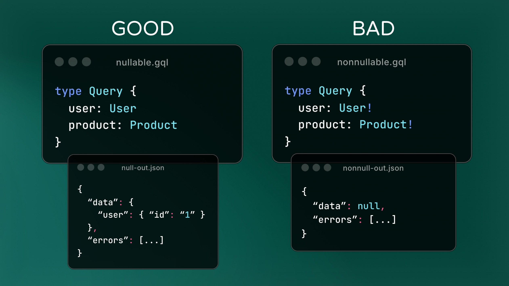

Another way to make your API more accessible is to better support partial results.

Returning partial data can dramatically improve a user’s experience for example if your system has a
partial outage. Keeping root query fields nullable ensures any one field can’t break the entire
client operation.

---

### Safe & Secure

To have a secure schema means to avoid leaking sensitive information, but also not being vulnerable
to attacks. One major vulnerability of vanilla GraphQL is Denial of Service attacks.

There’s no substitution for setting reasonable request timeouts. But tooling that restricts the size
of requests or that rate limits requests are also necessary for preventing DoS attacks

---

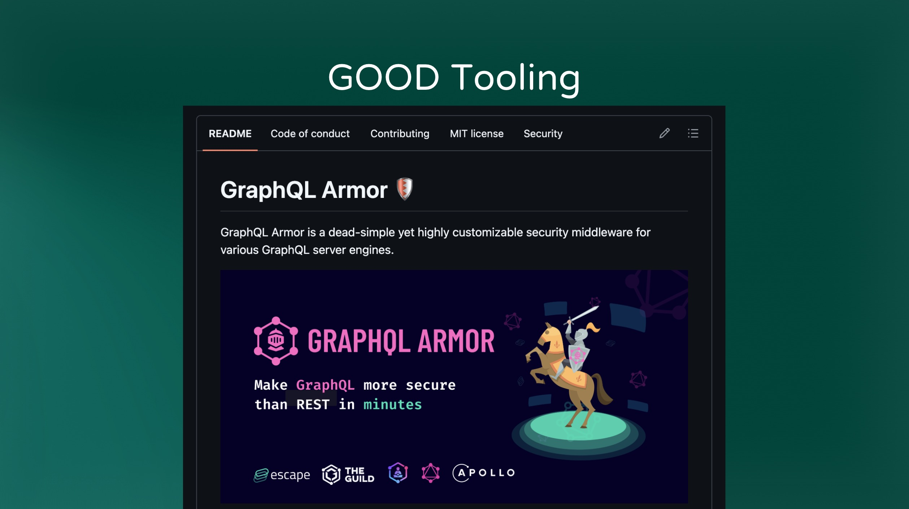

GraphQL Armor is a popular tool that has been integrated into most server implementations. It allows
you to restrict operations with a number of configuration options.

---

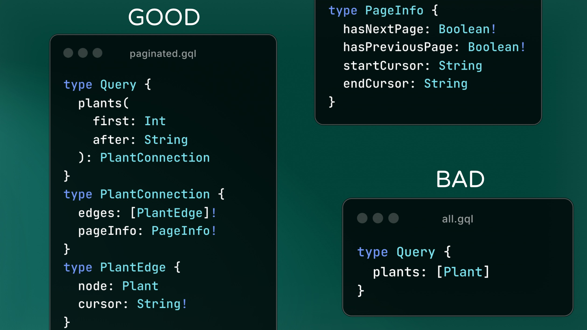

There’s also a few ways of designing your schema to limit attacks by limiting response sizes.

This schema shows the Relay Pagination Spec. Using pagination limits the amount load from any one
field. There are also other pagination specs that are equality suited.

Pagination is important to reduce the potential for DDOS attacks and to increase responsiveness of
your API, regardless of rate limiting or other protections.

However, if you know your data is guaranteed to have a small upper bound, then you can get away with
a simple array. Pagination adds a lot of complexity which is nice to avoid it if you can.

---

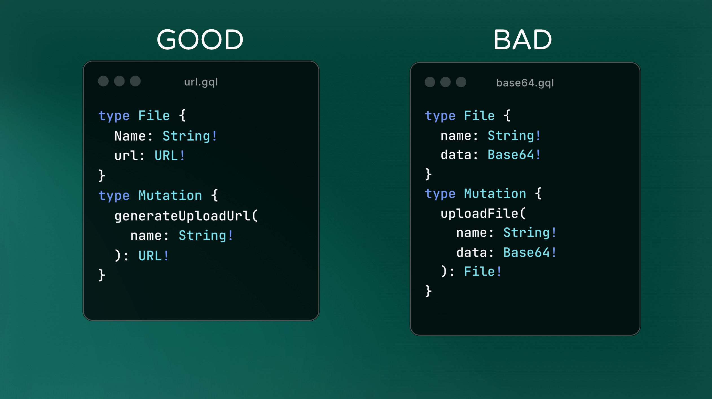

Also don’t place Binary Files or other large response fields in the Schema. Leverage CDNs and other
purpose built solutions meant for dealing with these files.

---

### Interactive

Another goal is for the schema to expose clear ways to interact with it. This may seem obvious, but
many times edge cases such as errors are forgotten or ignored.

---

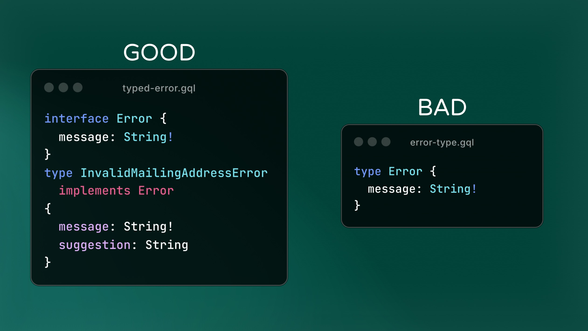

Placing your expected errors in the schema is incredibly valuable for consumers of your API. This
lets your API’s consumers know what can go wrong and potentially how to fix the issues.

This is sometimes called “typed errors” or “errors as data” or sometimes “expected errors”. But
whatever you call it, be sure to add meaningful fields to your errors so that clients can show
helpful information to users instead of a generic “Something went wrong” message.

However, don't move every possible intermittent failure into your schema. These errors are
potentially numerous and are meaningless to the API consumer. Those should be thrown and masked in
production to avoid leaking potentially sensitive information and to avoid forcing clients to handle
these cases.

---

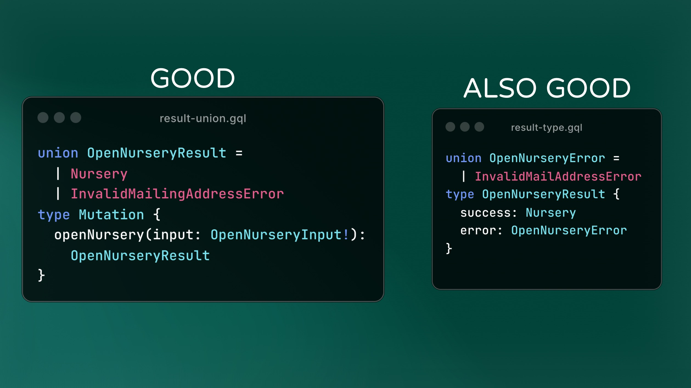

There are a few convenient ways to expose an error type in you schema. The first is to return a
union of your success results and error results. This adds the minimal number of types to your
schema, but relies on convention to separate the types. The other is to create a response type that
has fields indicating whether or not the request was successful or errored.

One is convention and the other is codified, but otherwise there isn't much difference. Both are
good.

---

### Consistent

Consistency is promoted by using patterns. And patterns make it easier for your team to develop
because they know “how things are done”. This applies to both developing and consuming the schema.
If everything is slightly different then it’s much harder to navigate because nothing is intuitive.

---

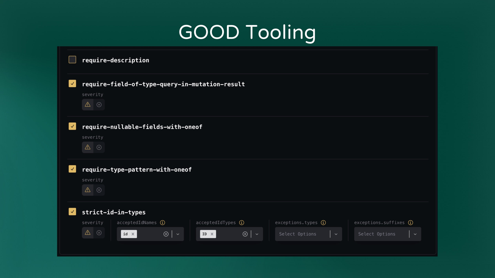

Consistency comes from implementing all of these things all the time. Tools like linters can help --
particularly when implementing linting rules in a Schema Registry so that every schema is consistent
with one another.

---

### Descriptive & Unambiguous

The last goal is to be descriptive and unambiguous. This means that our entities are accurately
reflected in the schema using a shared language. Shared language is the common set of terms that are
used to describe a thing such that there's no confusion about its identity. Simply put, shared
language is what everybody calls something.

There are a number of approaches that can be used to group fields and determine your shared
language. In part 2 of this article, we'll look at a few approaches and how they can be used to
create a descriptive and unambiguous schema.

---

_This information is from a talk given at GraphQL Conf 2025. A link will be added when the video is
made available to the public on the [@GraphQLFoundation](https://www.youtube.com/@GraphQLFoundation)
Youtube channel._
