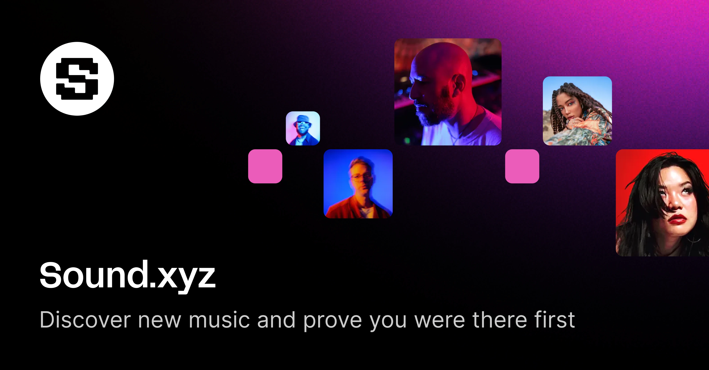

import { LargeCallout } from '@/components/large-callout'
import { Lede } from '@/components/lede'
import { ContactButton } from '@theguild/components'

<Lede>

Sound.xyz is revolutionizing the music industry by addressing two critical challenges: the
concentration of streaming revenue among top artists and the inadequate compensation per stream. As
they scale their platform to empower artists and build stronger community connections, their
technical infrastructure needs have evolved significantly, particularly in API management and
service architecture.

</Lede>

## Background

Sound.xyz was founded with a mission to transform the economics of music streaming. The platform
aims to address two fundamental problems in the current music industry:

- The extreme concentration of attention, where 90% of streams go to just 1% of artists
- The unsustainable economics of streaming, where artists earn only $0.003 per stream

The company's vision centers on creating a more equitable music ecosystem that properly values
artistic content and enables artists to build sustainable careers.

## Challenges

Sound.xyz implemented a sophisticated GraphQL-based architecture with the following key components:

1. **Scale and Complexity**
   - Moved from a monolithic structure to a microservices architecture
   - Enabled independent service scaling and development
   - Maintained service autonomy while ensuring cohesive API experience
2. **GraphQL Implementation**
   - Adopted GraphQL as the primary API layer for all clients
   - Implemented GraphQL stitching to combine multiple service schemas
   - Utilized Hive as the central source of truth for the GraphQL gateway
3. **Schema Management**

   Selected Hive as their GraphQL management platform due to:

   - Existing integration with GraphQL Inspector
   - Comprehensive schema management capabilities
   - Built-in analytics and monitoring
   - Breaking change detection and prevention

## Implementation

Sound.xyz's implementation journey began with a monolithic GraphQL API that served as the foundation
for their platform. As the platform grew, they systematically decomposed this monolith into
microservices, implementing GraphQL stitching to maintain a unified API interface. The integration
of Hive came as a natural progression, building upon their existing GraphQL Inspector implementation
and providing additional tools for schema management and API monitoring. This phased approach
allowed them to maintain service stability while gradually transitioning to a more scalable
architecture.

> Sodales lobortis tristique ac metus commodo. Amet etiam adipiscing arcu amet. Enim ornare cursus
> sed placerat commodo sed. Enim sagittis tincidunt aliquam eget lacinia curabitur. Maecenas egestas
> dignissim enim ullamcorper auctor amet.

<cite>
  <Avatar src="https://placedog.net/24/24" />
  **Name Surname** Sound.xyz
</cite>

## Results and Benefits

The implementation provided Sound.xyz with several key advantages:

1. **Developer Experience**
   - Unified schema management
   - Consistent API documentation
   - Improved development velocity
2. **Operational Efficiency**
   - Centralized API monitoring
   - Automated breaking change detection
   - Reduced maintenance overhead
3. **Platform Scalability**
   - Independent service scaling
   - Flexible architecture for new features
   - Improved system reliability

<LargeCallout
  heading="Heading goes here"
  variant="secondary"
  cta={
    <CallToAction variant="tertiary" href="#">
      Learn more
    </CallToAction>
  }
>
  Sodales lobortis tristique ac metus commodo. Amet etiam adipiscing arcu amet. Enim ornare cursus
  sed placerat commodo sed. Enim sagittis tincidunt aliquam eget lacinia curabitur. Maecenas egestas
  dignissim enim ullamcorper auctor amet.
</LargeCallout>

## Lessons Learned

Schema Management is Critical: Centralized schema management becomes increasingly important as the
number of services grows. Tool Selection Matters: Choosing Hive early provided built-in solutions
for common challenges. Architecture Evolution: Starting with a monolith and gradually transitioning
to microservices allowed for controlled growth.

<LargeCallout
  heading="Heading goes here"
  variant="primary"
  cta={<ContactButton variant="secondary-inverted" />}
>
  Sodales lobortis tristique ac metus commodo. Amet etiam adipiscing arcu amet. Enim ornare cursus
  sed placerat commodo sed. Enim sagittis tincidunt aliquam eget lacinia curabitur. Maecenas egestas
  dignissim enim ullamcorper auctor amet.
</LargeCallout>

## Future Considerations

As Sound.xyz continues to grow, they are well-positioned to:

- Scale their microservice architecture further
- Add new features and services independently
- Support an expanding developer ecosystem
- Maintain API stability while innovating rapidly

## Conclusion

Sound.xyz's implementation of a GraphQL-based architecture, managed through Hive, demonstrates how
modern API management tools can support rapid growth while maintaining stability and developer
experience. Their approach provides a valuable template for other organizations facing similar
challenges in scaling their API infrastructure.
