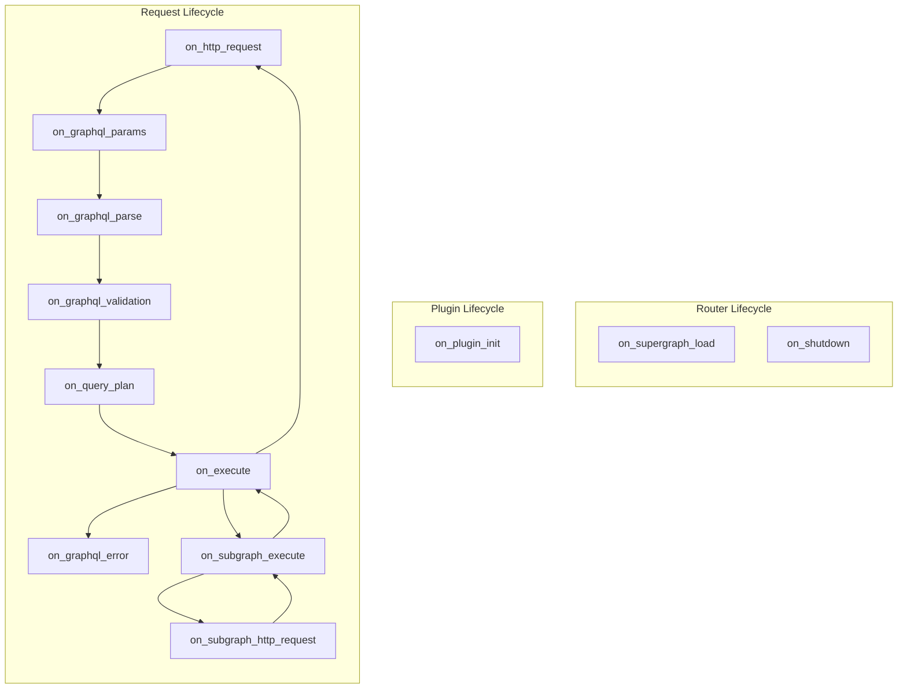

import { RouterHookSection } from '../../../components/router-plugin-system/hook-section';

# Plugin System

## Overview

Hive Router provides a plugin system that allows developers to extend its functionality with custom plugins. Plugins can be used to add new features, modify existing behavior, or integrate with external services.

Just like the Hive Router itself, custom plugins are written in Rust, which allows for high performance and safety. To ease the development process, Hive Router is also published to [Crates.io](https://crates.io/crates/hive-router) as a single package `hive-router` that contains everything you need in order to focus on building your plugin, without configuring or re-building other parts of the service.

This pages documents the API, hooks, and different implementation options that are available for plugin developers. If you are looking for a guide on how to write, test and distribute a custom plugin, please refer to [Extending the Router guide](../guides/extending-the-router).

## `hive-router` Crate

The [`hive-router`](https://crates.io/crates/hive-router) Crate provides everything a plugin developer needs in order to implement a custom plugin. 

To simplify the dependency tree and versioning, this crate also re-exports internal Router dependencies, traits, and structs, in order to make it simpler for developers to implement plugins and keep their Router core version up to date. 

Please refer to [the Crate's `lib.rs` entrypoint](https://github.com/graphql-hive/router/blob/main/bin/router/src/lib.rs) to find out what's being exported and can be re-used for extending the Router. 

## `trait RouterPlugin`

The basic interface that exposes the plugin system is called `RouterPlugin`. To implement a custom plugin, you'll need to `impl` the `RouterPlugin` for your custom plugin's`struct`. Due to the async nature of the plugin system, a usage of `#[async_trait]` is also needed. 

```rust
use hive_router::plugins::plugin_trait::RouterPlugin;
use hive_router::async_trait;

struct MyPlugin;

#[async_trait]
impl RouterPlugin for MyPlugin {
    type Config = ();
    
    fn plugin_name() -> &'static str {
        "my_plugin"
    }
}
```

The plugin above will be instansiated using the following Router YAML config:

```yaml
plugins:
  my_plugin:
    enabled: true
```


A plugin may implement one or more hooks, and have the following concepts implemented: 

### Configuration

The `RouterPlugin` trait also accepts a generic type for the configuration of the plugin. 

The configuration type requires to implement `DeserializeOwned + Sync` since the Router will be in charge of loading and deserializaing the configuration from the Router config file. 

The [`on_plugin_init`](#on_plugin_init) can help you to access the plugin's configuration.

```rust
use hive_router::plugins::plugin_trait::RouterPlugin;
use hive_router::async_trait;
use serde::Deserialize;

struct MyPlugin;

#[derive(Deserialize)]
struct MyPluginConfig {
    some_field: bool
}

#[async_trait]
impl RouterPlugin for MyPlugin {
    type Config = MyPluginConfig;
    
    fn plugin_name() -> &'static str {
        "my_plugin"
    }
    
    fn on_plugin_init(payload: OnPluginInitPayload<Self>) -> OnPluginInitResult<Self> {
        payload.initialize_plugin(Self { some_field: payload.config()?.some_field })
    }
}
```

The plugin above will be instansiated using the following Router YAML config:

```yaml
plugins:
  my_plugin:
    enabled: true
    config:
        some_field: true
```

### Hooks

A plugin may implement one or more hooks, and take part in different parts of the Router execution and lifecycle. 

Hooks allow the developer to be part of the control-flow and change the behavior of the router, by returning differnt return types from the hook function.

As a plugin developer, you can use the plugin system API in order to hook into the router execution flow, in the following areas of the Router: 

* HTTP request handling
* GraphQL operation lookup and extraction from the HTTP request
* GraphQL operation parsing
* GraphQL operation validation
* Federation query planner
* Query plan execution
* Subgraph request execution
* HTTP calls to subgraph
* Supergraph reload notification

The following chart describes the execution order and available hooks. Each hook can have a **start**/**end** phase, where you can control different parts of the execution flow.



### Shared State

A plugin may implement a state on the plugin `struct` itself, and access it using `self` in hooks. The state needs to be thread-safe, as it could be used and shared across multiple threads and HTTP requests that are being handled at the same time. Please refer to [Rust's Interior Mutability](https://doc.rust-lang.org/reference/interior-mutability.html) guide for more information about how to implement a mutable state.

```rust
use hive_router::plugins::plugin_trait::RouterPlugin;
use hive_router::async_trait;

struct MyPlugin {
    state: Mutex<Vec<String>>,
}

#[async_trait]
impl RouterPlugin for MyPlugin {
    type Config = ();
    
    fn plugin_name() -> &'static str {
        "my_plugin"
    }
    
    // In hooks, you can use `self.state` 
    fn on_http_request<'req>(
        &'req self,
        payload: OnHttpRequestHookPayload<'req>,
    ) -> OnHttpRequestHookResult<'req> {
        // For the sake of the demo, this plugin only stores the paths for all requests
        self.state.lock().unwrap().push(payload.request.uri().path().to_string());
        
        payload.proceed()
    }
}
```

### Context Data Sharing

In cases where you need to share data between hooks, you can use the a custom context struct. Define a custom struct to hold the data you would like to share between hooks, and use the hooks' payload to access the `context` field. 

For example, you can store some data in the context during the `on_graphql_params` hook and retrieve
it later in the `on_subgraph_execute` hook.


```rust filename="src/context_data.rs"
pub struct ContextData {
    incoming_data: &'static str,
}

#[async_trait::async_trait]
impl RouterPlugin for ContextDataPlugin {
    async fn on_graphql_params<'exec>(
        &'exec self,
        payload: OnGraphQLParamsStartHookPayload<'exec>,
    ) -> OnGraphQLParamsStartHookResult<'exec> {
        let context_data = ContextData {
            incoming_data: "world",
        };

        payload.context.insert(context_data);
    }
    
    async fn on_subgraph_execute<'exec>(
        &'exec self,
        mut payload: OnSubgraphExecuteStartHookPayload<'exec>,
    ) -> OnSubgraphExecuteStartHookResult<'exec> {
        // Get immutable reference from the context
        let context_data_entry = payload.context.get_ref::<ContextData>();
        if let Some(ref context_data_entry) = context_data_entry {
            tracing::info!("hello {}", context_data_entry.incoming_data); // Hello world!
        }
    }
}
```

The `payload.context` API is simple:

- `insert<T>(&self, data: T)` - Inserts data of type `T` into the context.
- `get_ref<T>(&self) -> Option<&T>` - Retrieves a reference to the data of type `T` from the context.
- `get_mut<T>(&mut self) -> Option<&mut T>` - Retrieves a mutable reference to the data of type `T` from the context.

> [See `context_data` example for a full implementation](https://github.com/graphql-hive/router/blob/main/plugin_examples/context_data/src/plugin.rs)

## Plugin Lifecycle Hooks

<RouterHookSection>

### `on_plugin_init`

This hook is called only once when the plugin is initialized, during the initialization process of the Router.

You can use this hook to access the plugin configuration, create the initial state of the plugin, and register background tasks to be handled by the router.

```rust
fn on_plugin_init(payload: OnPluginInitPayload<Self>) -> OnPluginInitResult<Self>
```

<details>

<summary>Access the plugin configuration</summary>

```rust
fn on_plugin_init(payload: OnPluginInitPayload<Self>) -> OnPluginInitResult<Self> {
    let config = payload.config()?;
    
    payload.initialize_plugin_with_defaults()
}
```

</details>

<details>

<summary>Customize plugin instance/state</summary>

```rust
fn on_plugin_init(payload: OnPluginInitPayload<Self>) -> OnPluginInitResult<Self> {
    payload.initialize_plugin(Self {
        my_thing: payload.config()?.my_config_flag,
    })
}
```

</details>

<details>

<summary>Register background tasks</summary>

```rust
use hive_router::background_tasks::BackgroundTask;

#[async_trait]
impl BackgroundTask for MyBackgroundTask {
    fn id(&self) -> &str {
        "my_task"
    }

    async fn run(&self, token: CancellationToken) {
        // do whatever you need here, this will run in background, in a separate thread
    }
}


fn on_plugin_init(payload: OnPluginInitPayload<Self>) -> OnPluginInitResult<Self> {
    payload.bg_tasks_manager.register_task(MyBackgroundTask::new());
    
    payload.initialize_plugin_with_defaults()
}
```

</details>

#### Payload API Reference

* [`OnPluginInitPayload`](https://github.com/graphql-hive/router/blob/main/lib/executor/src/plugins/hooks/on_plugin_init.rs#:~:text=struct%20OnPluginInitPayload)

#### Plugin Examples

* [`root_field_limit`](https://github.com/graphql-hive/router/blob/main/plugin_examples/root_field_limit/src/lib.rs#:~:text=fn%20on_plugin_init)
* [`propagate_status_code`](https://github.com/graphql-hive/router/blob/main/plugin_examples/propagate_status_code/src/lib.rs#:~:text=fn%20on_plugin_init)

</RouterHookSection>

## Request Lifecycle Hooks

<RouterHookSection>

### `on_http_request`

This hook is called immediately after the router receives an HTTP request. It allows you to inspect or modify the HTTP request before any further processing occurs. 
At this point, the Router doesn't know yet if the request is a GraphQL request or not.

```rust
fn on_http_request<'req>(
    &'req self,
    payload: OnHttpRequestHookPayload<'req>
  ) -> OnHttpRequestHookResult<'req>
```

> The `'req` lifetime parameter represents the lifetime of the HTTP request. It is used to ensure that the payload and result are valid for the duration of the request.

With this hook, you can implement custom handling of HTTP requests, such as implementing custom authentication and authorization logic based on HTTP headers, method, path, etc. You may also implement custom restrictions or HTTP validations, short-circuit, or serve static assets.

#### Usage Examples

<details>

<summary>Access HTTP request</summary>

```rust
fn on_http_request<'req>(
    &'req self,
    payload: OnHttpRequestHookPayload<'req>,
) -> OnHttpRequestHookResult<'req> {
    // Here you may access the incoming HTTP request
    let path = payload.router_http_request.path();

    // Call and return `payload.proceed()` in order to
    // signal the router to continue execution 
    payload.proceed()
}
```

</details>

<details>

<summary>Access HTTP response</summary>

```rust
fn on_http_request<'req>(
    &'req self,
    payload: OnHttpRequestHookPayload<'req>,
) -> OnHttpRequestHookResult<'req> {
    // Call and return `payload.on_end()` with a callback,
    // to have access to the "end" stage of the hook
    payload.on_end(|end_payload| {
        let status = payload.response.status();
        
        // Call and return `end_payload.proceed()` in order to
        // signal the router to continue
        end_payload.proceed()
    })
}
```

</details>

<details>

<summary>Modify HTTP response status</summary>

```rust
use hive_router::http::StatusCode;

fn on_http_request<'req>(
    &'req self,
    payload: OnHttpRequestHookPayload<'req>,
) -> OnHttpRequestHookResult<'req> {
    // Call and return `payload.on_end()` with a callback,
    // to have access to the "end" stage of the hook
    payload.on_end(|end_payload| {
        // Call and return `end_payload.map_response()` in order to access
        // a mutable reference to the response, and modify it
        return end_payload.map_response(|mut response| {
            *response.response_mut().status_mut() = StatusCode::OK;
            
            response
        })
    })
}
```

</details>

#### Payload API Reference

* [`OnHttpRequestHookPayload`](https://github.com/graphql-hive/router/blob/main/lib/executor/src/plugins/hooks/on_http_request.rs#:~:text=struct%20OnHttpRequestHookPayload)
* [`OnHttpResponseHookPayload`](https://github.com/graphql-hive/router/blob/main/lib/executor/src/plugins/hooks/on_http_request.rs#:~:text=struct%20OnHttpResponseHookPayload)

#### Plugin Examples

* [`propagate_status_code`](https://github.com/graphql-hive/router/blob/main/plugin_examples/propagate_status_code/src/lib.rs#:~:text=fn%20on_http_request)
* [`incoming_request_deduplication`](https://github.com/graphql-hive/router/blob/main/plugin_examples/incoming_request_deduplication/src/plugin.rs#:~:text=fn%20on_http_request)

</RouterHookSection>

<RouterHookSection>

### `on_graphql_params`

This hook is called after the router has determined that the incoming request is a GraphQL request,
and it decides to parse the GraphQL parameters (query, variables, operation name, etc.). 

This hooks allow you to implement different strategies for handling the detection and the extraction of the GraphQL request parameters. You may also prevent the execution of the GraphQL request if certain conditions are met.

```rust
async fn on_graphql_params<'exec>(
    &'exec self,
    payload: OnGraphQLParamsStartHookPayload<'exec>
  ) -> OnGraphQLParamsStartHookResult<'exec>
```

> The `'exec` lifetime parameter represents the lifetime of the GraphQL execution. It is used to ensure that the payload and result are valid for the duration of the GraphQL execution.

#### Usage Examples

<details>

<summary>Access GraphQL parameters</summary>

```rust
async fn on_graphql_params<'exec>(
    &'exec self,
    payload: OnGraphQLParamsStartHookPayload<'exec>) -> OnGraphQLParamsStartHookResult<'exec> {
    // This scope represents the "before" or params parsing,
    // so we might not have the GraphQL parameters yet. 
    
    // But, inside the on_end callback, extraction process is already
    // done, so we can access the GraphQL parameters 
    payload.on_end(|end_payload| {
        // Here we can access the GraphQL parameters
        let maybe_operation_name = &end_payload.graphql_params.operation_name.as_ref();
        let maybe_query = &end_payload.graphql_params.query.as_ref();
        let variables = &payload.graphql_params.variables;
        
        return end_payload.proceed();
    })
}
```

</details>

<details>

<summary>Modify GraphQL parameters</summary>

```rust
async fn on_graphql_params<'exec>(
    &'exec self,
    payload: OnGraphQLParamsStartHookPayload<'exec>) -> OnGraphQLParamsStartHookResult<'exec> {
        payload.on_end(|mut end_payload| {
            // Here we can access the GraphQL parameters and modify it as mutable
            end_payload.query = Some("query { overridingTheOperation }".to_string());
            
            return end_payload.proceed();
        })
}
```

</details>

#### Payload API Reference

* [`OnGraphQLParamsStartHookPayload`](https://github.com/graphql-hive/router/blob/main/lib/executor/src/plugins/hooks/on_graphql_params.rs#:~:text=struct%20OnGraphQLParamsStartHookPayload)
* [`OnGraphQLParamsEndHookPayload`](https://github.com/graphql-hive/router/blob/main/lib/executor/src/plugins/hooks/on_graphql_params.rs#:~:text=struct%20OnGraphQLParamsEndHookPayload)

#### Plugin Examples

* [`forbid_anonymous_operations`](https://github.com/graphql-hive/router/blob/main/plugin_examples/forbid_anonymous_operations/src/plugin.rs#:~:text=fn%20on_graphql_params)
* [`apq`](https://github.com/graphql-hive/router/blob/main/plugin_examples/apq/src/plugin.rs#:~:text=fn%20on_graphql_params)
* [`multipart`](https://github.com/graphql-hive/router/blob/main/plugin_examples/multipart/src/lib.rs#:~:text=fn%20on_graphql_params)
* [`async_auth`](https://github.com/graphql-hive/router/blob/main/plugin_examples/async_auth/src/plugin.rs#:~:text=fn%20on_graphql_params)

</RouterHookSection>

<RouterHookSection>

### `on_graphql_parse`

This hook is called after the deserialization of the request, and before the router has parsed the GraphQL
parameters body expected by [GraphQL-over-HTTP spec](https://graphql.github.io/graphql-over-http/).

```rust
async fn on_graphql_parse<'exec>(
        &'exec self,
        payload: OnGraphQLParseStartHookPayload<'exec>,
    ) -> OnGraphQLParseHookResult<'exec>
```

> The `'exec` lifetime parameter represents the lifetime of the GraphQL execution. It is used to ensure that the payload and result are valid for the duration of the GraphQL execution.

#### Usage Examples

<details>

<summary>Access the parsed GraphQL operation</summary>

```rust
async fn on_graphql_parse<'exec>(
        &'exec self,
        payload: OnGraphQLParseStartHookPayload<'exec>,
    ) -> OnGraphQLParseHookResult<'exec> {
        // At this point, the GraphQL operation was extracted and parsed from the incoming request.
        let parsed_document = &payload.graphql_params.query;
        
        payload.proceed()
    }
```

</details>

#### Payload API Reference

* [`OnGraphQLParseStartHookPayload`](https://github.com/graphql-hive/router/blob/main/lib/executor/src/plugins/hooks/on_graphql_parse.rs#:~:text=struct%20OnGraphQLParseStartHookPayload)
* [`OnGraphQLParseEndHookPayload`](https://github.com/graphql-hive/router/blob/main/lib/executor/src/plugins/hooks/on_graphql_parse.rs#:~:text=struct%20OnGraphQLParseEndHookPayload)

</RouterHookSection>

<RouterHookSection>

### `on_graphql_validation`

This hook is called during the GraphQL validation phase of the Router. At this stage, the GraphQL operation was extracted and parsed from the incoming request, and GraphQL validation rules are checking the validity of the GraphQL operation against the GraphQL schema.

Plugins can use this hook to add or modify validation rules, skip validation, or modify the operation before it's being validated. 

```rust
async fn on_graphql_validation<'exec>(
        &'exec self,
        payload: OnGraphQLValidationStartHookPayload<'exec>,
    ) -> OnGraphQLValidationStartHookResult<'exec>
```

> The `'exec` lifetime parameter represents the lifetime of the GraphQL execution. It is used to ensure that the payload and result are valid for the duration of the GraphQL execution.

#### Usage Examples

<details>

<summary>Add validation rules</summary>

```rust
impl ValidationRule for MaxAliasesRule {
    fn error_code<'a>(&self) -> &'a str {
        "MAX_ALIASES_EXCEEDED"
    }

    fn validate(
        &self,
        ctx: &mut OperationVisitorContext<'_>,
        error_collector: &mut ValidationErrorContext,
    ) {
        // ...
    }
}

sync fn on_graphql_validation<'exec>(
        &'exec self,
        payload: OnGraphQLValidationStartHookPayload<'exec>,
    ) -> OnGraphQLValidationStartHookResult<'exec> {
        let rule = MyCustomerValidationRule::new()

        payload.with_validation_rule(rule).proceed()
    }
```

</details>

#### Payload API Reference

* [`OnGraphQLValidationStartHookPayload`](https://github.com/graphql-hive/router/blob/main/lib/executor/src/plugins/hooks/on_graphql_validation.rs#:~:text=struct%20OnGraphQLValidationStartHookPayload)
* [`OnGraphQLValidationEndHookPayload`](https://github.com/graphql-hive/router/blob/main/lib/executor/src/plugins/hooks/on_graphql_validation.rs#:~:text=struct%20OnGraphQLValidationEndHookPayload)

#### Plugin Examples

* [`root_field_limit`](https://github.com/graphql-hive/router/blob/main/plugin_examples/root_field_limit/src/lib.rs#:~:text=fn%20on_graphql_validation)
* [`one_of`](https://github.com/graphql-hive/router/blob/main/plugin_examples/one_of/src/lib.rs#:~:text=fn%20on_graphql_validation)

</RouterHookSection>

<RouterHookSection>

### `on_query_plan`

This hook is invoked during the Federation query planning process. At this stage, the Router already extracted, parsed and validated the GraphQL operation, and it ready to plan how to execute the operation across subgraphs.

Plugins using this hook can have access to the Router internal process of query planning, modify the operation to plan, access the full plan, and modify it.

```rust
async fn on_query_plan<'exec>(
    &'exec self,
    payload: OnQueryPlanStartHookPayload<'exec>,
  ) -> OnQueryPlanStartHookResult<'exec>
```

> The `'exec` lifetime parameter represents the lifetime of the GraphQL execution. It is used to ensure that the payload and result are valid for the duration of the GraphQL execution.

#### Usage Examples

<details>

<summary>Access the query plan</summary>

```rust
async fn on_query_plan<'exec>(
    &'exec self,
    payload: OnQueryPlanStartHookPayload<'exec>,
) -> OnQueryPlanStartHookResult<'exec> {
    payload.on_end(|end_payload| {
        let query_plan = end_payload.query_plan;
        
        end_payload.proceed()
    })
}
```

</details>

#### Payload API Reference

* [`OnQueryPlanStartHookPayload`](https://github.com/graphql-hive/router/blob/main/lib/executor/src/plugins/hooks/on_query_plan.rs#:~:text=struct%20OnQueryPlanStartHookPayload)
* [`OnQueryPlanEndHookPayload`](https://github.com/graphql-hive/router/blob/main/lib/executor/src/plugins/hooks/on_query_plan.rs#:~:text=struct%20OnQueryPlanEndHookPayload)

#### Plugin Examples

* [`root_field_limit`](https://github.com/graphql-hive/router/blob/main/plugin_examples/root_field_limit/src/lib.rs#:~:text=fn%20on_query_plan)

</RouterHookSection>

<RouterHookSection>

### `on_execute`

This hook is invoked during the Federation query planning process. At this stage, the Router already extracted, parsed and validated the GraphQL operation. Also, a query plan has been constructed and is ready to be executed. 

Plugins using this hook can have access to the Router's execution process, implement solutions like caching and other flows that replaces the execution process as whole. 

```rust
async fn on_execute<'exec>(
    &'exec self,
    payload: OnExecuteStartHookPayload<'exec>,
  ) -> OnExecuteStartHookResult<'exec>
```

> The `'exec` lifetime parameter represents the lifetime of the GraphQL execution. It is used to ensure that the payload and result are valid for the duration of the GraphQL execution.

#### Usage Examples

<details>

<summary>Replace execution with custom response</summary>

```rust
async fn on_execute<'exec>(
        &'exec self,
        payload: OnExecuteStartHookPayload<'exec>,
    ) -> OnExecuteStartHookResult<'exec> {
        return payload.end_with_response(PlanExecutionOutput {
            body: "...",
            error_count: 0,
            response_headers_aggregator: None,
            status_code: StatusCode::OK,
        });
    }
```

</details>

<details>

<summary>Access the GraphQL response</summary>

```rust
async fn on_execute<'exec>(
        &'exec self,
        payload: OnExecuteStartHookPayload<'exec>,
    ) -> OnExecuteStartHookResult<'exec> {
        return payload.on_end(|end_payload| {
            let graphql_result = end_payload.data;
            let errors_vec = end_payload.errors;
            
            end_payload.proceed()
        });
    }
```

</details>

#### Payload API Reference

* [`OnExecuteStartHookPayload`](https://github.com/graphql-hive/router/blob/main/lib/executor/src/plugins/hooks/on_execute.rs#:~:text=struct%20OnExecuteStartHookPayload)
* [`OnExecuteEndHookPayload`](https://github.com/graphql-hive/router/blob/main/lib/executor/src/plugins/hooks/on_execute.rs#:~:text=struct%20OnExecuteEndHookPayload)

#### Plugin Examples

* [`one_of`](https://github.com/graphql-hive/router/blob/main/plugin_examples/one_of/src/lib.rs#:~:text=fn%20on_execute)
* [`response_cache`](https://github.com/graphql-hive/router/blob/main/plugin_examples/response_cache/src/lib.rs#:~:text=fn%20on_execute)

</RouterHookSection>

<RouterHookSection>

### `on_subgraph_execute`

This hook is called during the preparation prcoess of every subgraph request, based on the query plan.
At this stage, we have the subgraph name, the execution request that would be sent to the subgraph,
and other contextual information.

Plugins using this hook can have control over the planning process of subgraph requests, replace/modify a subgraph response, pass custom data to subgraphs, and handle custom execution transports.

Unlike `on_subgraph_http_request` hook, this hook still doesn't have the complete HTTP request that needs to be sent to the subgraph. 

```rust
async fn on_subgraph_execute<'exec>(
        &'exec self,
        payload: OnSubgraphExecuteStartHookPayload<'exec>,
    ) -> OnSubgraphExecuteStartHookResult<'exec>
```

> The `'exec` lifetime parameter represents the lifetime of the GraphQL execution. It is used to ensure that the payload and result are valid for the duration of the GraphQL execution.

#### Payload API Reference

* [`OnSubgraphExecuteStartHookPayload`](https://github.com/graphql-hive/router/blob/main/lib/executor/src/plugins/hooks/on_subgraph_execute.rs#:~:text=struct%20OnSubgraphExecuteStartHookPayload)
* [`OnSubgraphExecuteEndHookPayload`](https://github.com/graphql-hive/router/blob/main/lib/executor/src/plugins/hooks/on_subgraph_execute.rs#:~:text=struct%20OnSubgraphExecuteEndHookPayload)

#### Plugin Examples

* [`context_data`](https://github.com/graphql-hive/router/blob/main/plugin_examples/context_data/src/plugin.rs#:~:text=fn%20on_subgraph_execute)

</RouterHookSection>

<RouterHookSection>

### `on_subgraph_http_request`

This hook is called during the actual HTTP call made to the subgraph. In this hook, you have access to the full HTTP request that will be sent to the subgraph.

Plugins using this hook can extend or modify the HTTP request, HTTP headers, path and other ascepts on communicating with the subgraph. 

In addition, you can use this hook for passing along or storing information and data that comes from subgraphs. 

```rust
async fn on_subgraph_http_request<'exec>(
        &'exec self,
        payload: OnSubgraphHttpRequestStartHookPayload<'exec>,
    ) -> OnSubgraphHttpRequestStartHookResult<'exec>
```

> The `'exec` lifetime parameter represents the lifetime of the GraphQL execution. It is used to ensure that the payload and result are valid for the duration of the GraphQL execution.

#### Payload API Reference

* [`OnSubgraphHttpRequestHookPayload`](https://github.com/graphql-hive/router/blob/main/lib/executor/src/plugins/hooks/on_subgraph_http_request.rs#:~:text=struct%20OnSubgraphHttpRequestHookPayload)
* [`OnSubgraphHttpResponseHookPayload`](https://github.com/graphql-hive/router/blob/main/lib/executor/src/plugins/hooks/on_subgraph_http_request.rs#:~:text=struct%20OnSubgraphHttpResponseHookPayload)

#### Plugin Examples

* [`propagate_status_code`](https://github.com/graphql-hive/router/blob/main/plugin_examples/propagate_status_code/src/lib.rs#:~:text=fn%20on_subgraph_http_request)
* [`multipart`](https://github.com/graphql-hive/router/blob/main/plugin_examples/multipart/src/lib.rs#:~:text=fn%20on_subgraph_http_request)

</RouterHookSection>

<RouterHookSection>

### `on_graphql_error`

This hook is called whenever a GraphQL error is about to be sent to the client, during plan execution. This hook allows you to
inspect or modify the error before it is sent. 

You can use this hook to implement custom error handling logic, such as masking certain error details, adding additional information to the error
response, or even transforming the error into a different format.

```rust
    fn on_graphql_error(
        &self,
        payload: OnGraphQLErrorHookPayload
    ) -> OnGraphQLErrorHookResult;
```

<details>

<summary>Custom error handling</summary>

```rust
fn on_graphql_error(&self, mut payload: OnGraphQLErrorHookPayload) -> OnGraphQLErrorHookResult {
    // You may use, access and collect the "payload.error.message" error Here
    // A custom plugin can collect and later process and handle the error in any way
    payload.collected_errors.push(payload.error.message);
    
    payload.proceed()
}
```

</details>

<details>

<summary>Error masking</summary>

```rust
fn on_graphql_error(&self, mut payload: OnGraphQLErrorHookPayload) -> OnGraphQLErrorHookResult {
    payload.error.message = "An error occurred".to_string();
    payload.error.path = None;
    
    payload.proceed()
}
```

</details>

#### Payload API Reference

* [`OnGraphQLErrorHookPayload`](https://github.com/graphql-hive/router/blob/main/lib/executor/src/plugins/hooks/on_graphql_error.rs#:~:text=struct%20OnGraphQLErrorHookPayload)

#### Plugin Examples

* [`error_mapping`](https://github.com/graphql-hive/router/blob/main/plugin_examples/error_mapping/src/plugin.rs#:~:text=fn%20on_graphql_error)

</RouterHookSection>

## Router Lifecycle

<RouterHookSection>

### `on_shutdown`

This hook is called when the router is shutting down.

Plugins can use this hook in order to implement cleanup/flush logic.

```rust
async fn on_shutdown<'exec>(&'exec self)
```

#### Plugin Examples

* [`usage_reporting`](https://github.com/graphql-hive/router/blob/main/plugin_examples/usage_reporting/src/lib.rs#:~:text=fn%20on_shutdown)

</RouterHookSection>

<RouterHookSection>

### `on_supergraph_load`

This hook is called whenever the supergraph is loaded or reloaded. This can happen at startup or when the supergraph is being reloaded from any source.

Plugins can use this hook to clear/reset caches, or to restart their state, in cases where they depend on the GraphQL schema structure.

This hook will be called at least once for a healthy router instance, as the supergraph is being loaded at startup. If the Router configuration also uses polling to reload the GraphQL schema, then it might get called more than one time. 

```rust
fn on_supergraph_reload<'exec>(
        &'exec self,
        start_payload: OnSupergraphLoadStartHookPayload,
    ) -> OnSupergraphLoadStartHookResult<'exec>
```

#### Payload API Reference

* [`OnSupergraphLoadStartHookPayload`](https://github.com/graphql-hive/router/blob/main/lib/executor/src/plugins/hooks/on_supergraph_load.rs#:~:text=struct%20OnSupergraphLoadStartHookPayload)
* [`OnSupergraphLoadEndHookPayload`](https://github.com/graphql-hive/router/blob/main/lib/executor/src/plugins/hooks/on_supergraph_load.rs#:~:text=struct%20OnSupergraphLoadEndHookPayload)

#### Plugin Examples

* [`one_of`](https://github.com/graphql-hive/router/blob/main/plugin_examples/one_of/src/lib.rs#:~:text=fn%20on_supergraph_reload)
* [`response_cache`](https://github.com/graphql-hive/router/blob/main/plugin_examples/response_cache/src/lib.rs#:~:text=fn%20on_supergraph_reload)

</RouterHookSection>

## Control Flow

### Short-Circuit Responses

In many of the hooks mentioned above, you have the ability to short-circuit the request processing
by providing a custom response.

Let's say you want to implement a plugin that returns an early error response in some cases;

```rust
return payload.end_with_response(
    Response::with_body(
        StatusCode::BAD_REQUEST,
        body.to_string().into(),
    )
);
```

Here we use `end_with_response` method on the `payload` to provide a custom HTTP response. But there
are some helper methods to make it easier to create early responses.

You can see
[forbid_anonymous_operations](https://github.com/graphql-hive/router/blob/main/plugin_examples/forbid_anonymous_operations/src/plugin.rs#L40)
example to see a full example.

#### Helpers for early responses

To make it easier to create early responses, Hive Router provides some helper methods on the hook
payloads.

- `end_with_response_body(body: Serialize, status_code: StatusCode)` - This method allows you to
  provide a response body that is serializable using `serde`. It automatically serializes the body
  to JSON and sets the appropriate headers. So if we want to write less code for the above example,
  we can do the following;

```rust filename="src/forbid_anon_ops.rs" {33-52}
                let body = json!({
                    "errors": [
                        {
                            "message": "Anonymous operations are not allowed",
                            "extensions": {
                                "code": "ANONYMOUS_OPERATION"
                            }
                        }
                    ]
                });
                // Here we short-circuit the request processing by returning an early response
                return payload.end_with_response_body(
                    body,
                    StatusCode::BAD_REQUEST,
                );
```

- `end_with_graphql_error(error: GraphQLError, status: StatusCode)` - This method allows you to
  provide a `GraphQLError` directly, and it constructs the appropriate GraphQL error response for
  you.

```rust filename="src/forbid_anon_ops.rs" {33-52}
                let graphql_error = GraphQLError::from_message_and_code("Anonymous operations are not allowed", "ANONYMOUS_OPERATION");
                // Here we short-circuit the request processing by returning an early response
                return payload.end_with_graphql_error(
                    graphql_error,
                    StatusCode::BAD_REQUEST,
                );
```

### Overriding Default Behavior

Instead of short-circuiting the entire HTTP request, and returning an early HTTP response, you might
want to override default behavior in certain stages.

For example, in case of automatic persisted queries, you basically need to manipulate the parsed
request body received from the client. In this case, you need to modify the `query` field in the
`GraphQLParams` struct to put the actual query string into it based on the hash received from the
client.

```rust
#[async_trait::async_trait]
impl RouterPlugin for APQPlugin {
    async fn on_graphql_params<'exec>(
        &'exec self,
        payload: OnGraphQLParamsStartHookPayload<'exec>,
    ) -> OnGraphQLParamsStartHookResult<'exec> {
        payload.on_end(|mut payload| {
            let persisted_query_ext = payload
                .graphql_params
                .extensions
                .as_ref()
                .and_then(|ext| ext.get("persistedQuery"))
                .and_then(|pq| pq.as_object());

            // Get the original query string from the map using the hash from the extensions
            let query = get_persisted_query(persisted_query_ext);
            payload.graphql_params.query = Some(query);

            payload.proceed()
        })
    }
}
```

[See `apq` example for a full implementation](https://github.com/graphql-hive/router/blob/main/plugin_examples/apq/src/plugin.rs#L29)

## Integrations

### OpenTelemetry Traces 

TODO

### Logging

Hive Router is using the [`tracing` Crate](https://docs.rs/tracing/latest/tracing/) for its internal logging. Logs emitted from plugin are correlated with the request it's processing.

You may use the built-in macros (such as `debug!(...)`, `info!(...)`, `warn!(...)` and `error!(...)`), and the log lines will appear based on the Router's logger configuration.
