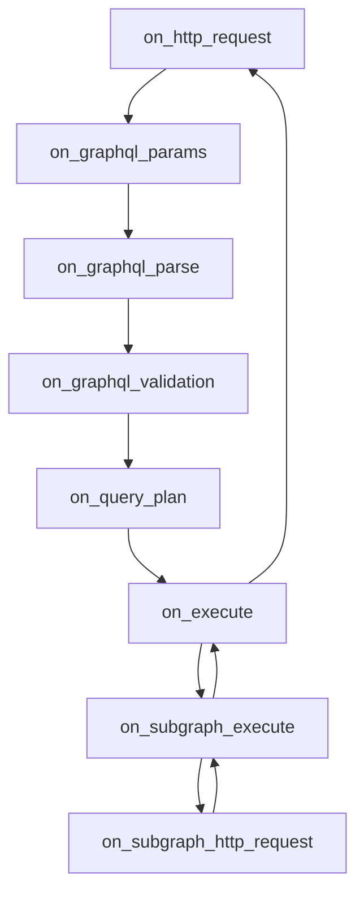

import { Callout, Tabs } from '@theguild/components'

# Extending the Router

Hive Router is designed to be flexible and extensible, allowing you to customize its behavior to fit
your specific needs. This guide explores various ways to extend the router's functionality,
including custom plugins.

## Getting Started

Hive Router is built using Rust, which allows for high performance and safety. One of the powerful
features of Hive Router is the ability to create custom builds with your own Rust plugins. This
enables you to add new capabilities or modify existing ones to better suit your requirements.

### Create a new Rust project

First, ensure you have the necessary development environment set up for
[Rust 1.91.1 or later](https://rust-lang.org/tools/install/). Then, you need to create a new Rust
project for your custom router;

```bash
cargo new --bin my_custom_router
cd my_custom_router
```

### Installing Dependencies

Install `hive-router` and `serde` as a dependency by adding it to your `Cargo.toml` file:

```toml
[dependencies]
hive-router = "0.0.39"
serde = "1"
```

### Create an entrypoint for your custom router

Next, you need to create an entrypoint for your custom router. This is where you'll initialize the
router and register your plugins. Create a new file `src/main.rs` and add the following code:

```rust
use hive_router::{
    error::RouterInitError, init_rustls_crypto_provider, router_entrypoint, DefaultGlobalAllocator,
    PluginRegistry,
};

#[global_allocator]
static GLOBAL: DefaultGlobalAllocator = DefaultGlobalAllocator;

#[ntex::main]
async fn main() -> Result<(), RouterInitError> {
    init_rustls_crypto_provider();

    /// Start the Hive Router with the plugin registry
    router_entrypoint(PluginRegistry::new()).await
}
```

### Provide an example supergraph

You can use our example supergraph as a starting point;

```bash
curl -sSL https://federation-demo.theguild.workers.dev/supergraph.graphql > supergraph.graphql
```

Then point to that supergraph in your `router.config.yaml`:

```yaml filename="router.config.yaml"
supergraph:
  source: file
  path: ./supergraph.graphql
```

Or you can use other ways to provide the supergraph, see
[Supergraph Sources](https://the-guild.dev/graphql/hive/docs/router/supergraph).

### Create a custom plugin

Now you can create a custom plugin by implementing the `RouterPlugin` trait. For example, let's say
you want to create a plugin that logs the incoming GraphQL operations. You can create a new file
`src/plugin.rs` and add the following code:

```rust
use hive_router::{
    async_trait,
    plugins::{
        hooks::{
            on_graphql_params::{OnGraphQLParamsStartHookPayload, OnGraphQLParamsStartHookResult}, on_plugin_init::{OnPluginInitPayload, OnPluginInitResult}
        },
        plugin_trait::{RouterPlugin, StartHookPayload},
    },
};

#[derive(Default)]
pub struct MyPlugin;

#[async_trait]
impl RouterPlugin for MyPlugin {
    type Config = ();
    fn plugin_name() -> &'static str {
        "my_plugin"
    }
    fn on_plugin_init(payload: OnPluginInitPayload<Self>) -> OnPluginInitResult<Self> {
        payload.initialize_plugin_with_defaults()
    }
    async fn on_graphql_params<'exec>(
        &'exec self,
        payload: OnGraphQLParamsStartHookPayload<'exec>,
    ) -> OnGraphQLParamsStartHookResult<'exec> {
        tracing::info!("Received GraphQL operation: {:?}", payload.graphql_params.query);
        payload.proceed()
    }
}

```

Then register your plugin in the `main.rs`:

```diff
use hive_router::{
    error::RouterInitError, init_rustls_crypto_provider, ntex, router_entrypoint,
    DefaultGlobalAllocator, PluginRegistry,
};
+ mod plugin;
+ use plugin::MyPlugin;

#[global_allocator]
static GLOBAL: DefaultGlobalAllocator = DefaultGlobalAllocator;

#[hive_router::main]
async fn main() -> Result<(), RouterInitError> {
    init_rustls_crypto_provider();

    router_entrypoint(
        PluginRegistry::new()
+            .register::<MyPlugin>()
    ).await
}
```

### Configure your plugins in `router.config.yaml`

`plugins` section in your `router.config.yaml` allows you to configure your custom plugins. Here is
an example configuration:

```yaml filename="router.config.yaml"
plugins:
  my_plugin:
    enabled: true
```

During this phase of development, you need to learn more about the Hive Router plugin system and how
the hooks are structured.

### Run your custom router

Finally, you can build and run your custom router using Cargo:

```bash
cargo run
```

## Hooks Lifecycle

We have the following lifecycle hooks available for plugins:



In addition there is also `on_supergraph_load` hook that is called when the supergraph is loaded or
reloaded.

### `on_http_request`

This hook is called immediately after the router receives an HTTP request. It allows you to inspect
or modify the request before any further processing occurs. Remember that, we don't know yet if the
request is a GraphQL request or not.

On the start of this hook, you can do the following things for example;

- Implement custom authentication and authorization logic based on HTTP headers, method, path, etc.
- Short-circuit the request by providing a custom response (for example for health checks or
  metrics, or custom playgrounds like Apollo Sandbox, Altair etc.)

On the end of this hook, you can do the following things for example;

- Header propagation from the incoming request to the final response.
- Custom HTTP Caching headers for your response caching plugin that also uses those headers.
- Handle deserialization for different content types other than JSON

You can check the following example implementations;

- [`apollo_sandbox`](https://github.com/graphql-hive/router/tree/main/plugin_examples/apollo_sandbox)
  plugin that serves Apollo Sandbox in a custom endpoint using `on_http_request` hook
- [`propagate_status_code`](https://github.com/graphql-hive/router/tree/main/plugin_examples/propagate_status_code)
  plugin that propagates status codes from subgraphs to clients using the end phase of
  `on_http_request` hook by manipulating the final response

### `on_graphql_params`

This hook is called after the router has determined that the incoming request is a GraphQL request
and it decides to parse the GraphQL parameters (query, variables, operation name, etc.). Here you
can;

On this hook's start;

- Handle a specific validation based on the GraphQL parameters
- Inspect or modify the raw body
- Short-circuit the request by providing a custom response (for example for caching)
- Custom request parsing like Multipart requests

On this hook's end;

- Persisted Operations or Trusted Documents so that you can get the operation key from the body, and
  put the actual `query` string into the GraphQL parameters body. Then the router can continue
  processing the request as usual.
- Max Tokens security check that counts the tokens in the operation and rejects the request if it
  exceeds a certain limit.
- Any auth logic that relies on `extensions` or other GraphQL parameters instead of HTTP-specific
  `headers`.
- A potential response caching plugin that caches based on GraphQL parameters, so that it returns
  the response before any further steps like parsing, validation, execution.

You can check the following example implementations;

- [`forbid_anonymous_operations`](https://github.com/graphql-hive/router/tree/main/plugin_examples/forbid_anonymous_operations)
  example that checks the parsed `operation_name` in the end payload of this hook and rejects the
  operations without operation names.
- [`apq`](https://github.com/graphql-hive/router/tree/main/plugin_examples/apq) example shows how to
  implement a simple Automatic Persisted Queries plugin using this hook. So it takes the hash from
  the extensions from the parsed body, and looks up the actual query from a map then puts it into
  the GraphQL parameters.
- [`multipart`](https://github.com/graphql-hive/router/tree/main/plugin_examples/multipart) plugin
  that parses the body using `multer`, and holds the file bytes in the context then fetches then
  lazily when needed during the subgraph execution. So it shows how to override parsing logic using
  this hook.
- [`async_auth`](https://github.com/graphql-hive/router/tree/main/plugin_examples/async_auth) plugin
  that shows how to implement a custom auth logic

### `on_graphql_parse`

This hook is called after the deserialization of the request, and the router has parsed the GraphQL
parameters body expected by GraphQL-over-HTTP spec. But we still need to parse the operation into
AST.

On the start of this hooks, you can do the following things for example;

- Some kind of trusted documents implementation that holds not the string representation of the
  query, but the parsed AST in a map. So when you get the query string from the GraphQL parameters,
  you can look up the AST from the map and put it into the context. Then the router can skip parsing
  step.
- Replace or extend the parser for some future RFCs like Fragment Variables etc.

On the end of this hook, you can do the following things for example;

- Prevent certain operations from being executed by checked the HTTP headers or other request
  properties along with the parsed AST.
- Logging or metrics based on the parsed AST like counting certain fields or directives usage.

### `on_graphql_validation`

This hook is called after the router is ready to validate the operation against the supergraph. In
this stage, we know the supergraph and the operation are ready for validation, then query planning
and execution if valid.

On the start of this hook, you can do the following things for example;

- Skip validation for certain operations based on request properties like headers, method, etc.
- Or skip validation for trusted documents/persisted operations since they are trusted
- Custom validation rules like `@oneOf` directive validation etc.
- Custom rules for max depth analysis, rate limiting based on the operation structure
- Preventing the introspection queries based on request properties
- Caching the validation result in some other ways, if cache hit, you can skip validation

On the end of this hook, you can do the following things for example;

- Bypassing certain errors based on request properties
- Again caching the validation result in some other ways

You can check the following example implementations;

- [`root_field_limit`](https://github.com/graphql-hive/router/tree/main/plugin_examples/root_field_limit)
  plugin that implements a new `ValidationRule` to limit the number of root fields in an operation
  using this hook.
- [`one_of`](https://github.com/graphql-hive/router/tree/main/plugin_examples/one_of) plugin is a
  more complicated one that combines this hook and `on_execute` hook to implement custom validation
  and execution logic for `@oneOf` directive.

### `on_query_plan`

This hook is invoked before the query planner starts the planning process. At this point, we have
the query planner, normalized document, the supergraph, and the public schema and all the parameters
needed for the planning.

On the start of this hook, you can do the following things for example;

- Modify the normalized document that is used for planning, or do some validation based on it since
  this is the normalized, flattened version of the operation.

On the end of this hook, you can do the following things for example;

- Demand Control or Cost Limiting based on the subgraph requests that would be made for the
  operation.

You can check the following example implementations;

- [`root_field_limit`](https://github.com/graphql-hive/router/tree/main/plugin_examples/root_field_limit)
  plugin that implements another variant of root field limiting using this hook besides
  `on_graphql_validation`.

### `on_execute`

Whenever the variables are coerced in addition to the operation being valid just like other
parameters. This hook is called before the execution starts. At this point, we have the query plan
ready along with the coerced variables. So you can block the operation, manipulate the result,
variables, etc.

This is different the end of `on_query_plan` hook because we don't have all the parameters ready
like coerced variables, filling the introspection fields that are seperated from the actual planning
and execution etc.

On the start of this hook, you can do the following things for example;

- Response Caching based on the query plan or the operation AST together with the coerced variables,
  and some auth info from the request.
- Blocking certain operations based on the query plan structure together with the coerced variables.

On the end of this hook, you can do the following things for example;

- Add extra metadata to the response based on the execution result like response cache info, tracing
  info, some information about the query plan used etc.

You can check the following example implementations;

- [`one_of`](https://github.com/graphql-hive/router/tree/main/plugin_examples/one_of) plugin that
  implements the execution logic for `@oneOf` directive using this hook. `on_graphql_validation` is
  not enough by itself because the coerced variables need to be checked as well.
- [`response_cache`](https://github.com/graphql-hive/router/tree/main/plugin_examples/response_cache)
  plugin that implements a simple response caching mechanism using this hook.

### `on_subgraph_execute`

This hook is called before an execution request is prepared for a subgraph based on the query plan.
At this point, we have the subgraph name, the execution request that would be sent to the subgraph,
and other contextual information.

But we still don't have the actual "HTTP" request that would be sent to the subgraph. So this is
different than `on_subgraph_http_request` hook. So this is before the serialization to HTTP request.
On the other hand, at the end of this hook, we have deserialized version of the subgraph response,
but not the actual HTTP response.

On the start of this hook, you can do the following things for example;

- Mocking the subgraph response based on the execution request and other request properties.
- Demand Control and Cost Limiting based on the execution request and other request properties.
- Handling a custom subgraph auth like HMAC and JWT based auth by manipulating the execution request
  headers.
- Custom subgraph execution logic for different transports like protobuf instead of JSON over HTTP.
- APQ for subgraph requests by storing the persisted queries for subgraphs.
- Block some subgraph operations based on some policy. This is the right time before the
  serialization.

On the end of this hook, you can do the following things for example;

- Any work that needs to be done such as collecting `extensions` data from subgraph responses for
  logging, metrics, tracing etc.

You can check the following example implementations;

- [`subgraph_response_cache`](https://github.com/graphql-hive/router/tree/main/plugin_examples/subgraph_response_cache)
  plugin that implements a simple subgraph response caching mechanism using this hook.
- [`context_data`](https://github.com/graphql-hive/router/tree/main/plugin_examples/context_data)
  plugin that shows how to pass data between the main request lifecycle and subgraph execution using
  this hook.

### `on_subgraph_http_request`

After the subgraph execution request is serialized into an actual HTTP request, this hook is
invoked. At this point, you have access to the full HTTP request that will be sent to the subgraph.

On the start of this hook, you can do the following things for example;

- Send custom headers to subgraphs based on the main request properties.
- Some custom HTTP-based subgraph auth mechanisms like AWS Sigv4 that generates signature based on
  HTTP properties and the payload
- Change the HTTP method, URL, or other properties based on some logic.
- Choose different endpoints based on the request parameters like region, version, etc.
- HTTP based caching
- Limit the request size based on some policy.
- Replace the default HTTP transport with some custom transport like multipart/form-data for file
  uploads.

On the end of this hook, you can do the following things for example;

- Header propagation but this time from the subgraph response to the main response.
- Forward cookies from subgraph responses to the main response.
- HTTP Caching's response side based on HTTP response headers like ETag, Cache-Control etc.
- Respecting TTL returned by the subgraph in your response caching plugin. So you can decide on the
  final TTL based on subgraph response headers.

You can check the following example implementations;

- [`propagate_status_code`](https://github.com/graphql-hive/router/tree/main/plugin_examples/propagate_status_code)
  plugin that propagates status codes from subgraphs to clients using the end phase of this hook by
  manipulating the final response.
- [`multipart`](https://github.com/graphql-hive/router/tree/main/plugin_examples/multipart) plugin
  that overrides the default deserialization logic of Hive Router to handle `multipart/form-data`
  requests from the client, and it holds the files in the context for lazy fetching during subgraph
  execution. In this hook, it re-uses the files from the context to prepare the subgraph HTTP
  request, and replaces the default JSON-based HTTP transport with `multipart/form-data` when
  needed.

### `on_supergraph_load`

This hook is called whenever the supergraph is loaded or reloaded. This can happen at startup or
when the supergraph configuration changes.

You can do the following things for example;

- Precalculate some data based on the supergraph schema that would be used later during request
  processing such as TTL calculation based on `@cacheControl` directives for response caching
  plugin.
- In addition to above, you can also precalculate cost analysis data for cost limiting plugins.
- You can also refresh the state of the plugin based on the supergraph changes, for example the
  caching plugins can clear their caches.

You can check the following example implementations;

- [`one_of`](https://github.com/graphql-hive/router/tree/main/plugin_examples/one_of) plugin that
  precalculates the `@oneOf` directive locations in the supergraph schema for faster access during
  request processing. So it avoids traversing the schema for each request, and refreshes the state
  whenever the supergraph is reloaded.
- [`response_cache`](https://github.com/graphql-hive/router/tree/main/plugin_examples/response_cache)
  plugin that precalculates the TTL information based on `@cacheControl` directives in the
  supergraph schema for response caching.

### `on_shutdown`

This hook is called when the router is shutting down. If your plugin holds resources that need to be
cleaned up, you can implement this method to perform the necessary cleanup.

You can do the following things for example;

- Close database connections or file handles.
- Flush any pending logs or metrics.
- Perform any other necessary cleanup tasks to ensure a graceful shutdown.

You can check the following example implementations;

- [`usage_reporting`](https://github.com/graphql-hive/router/tree/main/plugin_examples/usage_reporting)
  plugin that flushes any pending usage reports to the server before shutdown.

## Short Circuit Responses

In many of the hooks mentioned above, you have the ability to short-circuit the request processing
by providing a custom response.

Let's say you want to implement a plugin that returns an early error response in some cases;

```rust
return payload.end_with_response(
    Response::with_body(
        StatusCode::BAD_REQUEST,
        body.to_string().into(),
    )
);
```

Here we use `end_with_response` method on the `payload` to provide a custom HTTP response. But there
are some helper methods to make it easier to create early responses.

You can see
[forbid_anonymous_operations](https://github.com/graphql-hive/router/blob/main/plugin_examples/forbid_anonymous_operations/src/plugin.rs#L40)
example to see a full example.

### Helpers for early responses

To make it easier to create early responses, Hive Router provides some helper methods on the hook
payloads.

- `end_with_response_body(body: Serialize, status_code: StatusCode)` - This method allows you to
  provide a response body that is serializable using `serde`. It automatically serializes the body
  to JSON and sets the appropriate headers. So if we want to write less code for the above example,
  we can do the following;

```rust filename="src/forbid_anon_ops.rs" {33-52}
                let body = json!({
                    "errors": [
                        {
                            "message": "Anonymous operations are not allowed",
                            "extensions": {
                                "code": "ANONYMOUS_OPERATION"
                            }
                        }
                    ]
                });
                // Here we short-circuit the request processing by returning an early response
                return payload.end_with_response_body(
                    body,
                    StatusCode::BAD_REQUEST,
                );
```

- `end_with_graphql_error(error: GraphQLError, status: StatusCode)` - This method allows you to
  provide a `GraphQLError` directly, and it constructs the appropriate GraphQL error response for
  you.

```rust filename="src/forbid_anon_ops.rs" {33-52}
                let graphql_error = GraphQLError::from_message_and_code("Anonymous operations are not allowed", "ANONYMOUS_OPERATION");
                // Here we short-circuit the request processing by returning an early response
                return payload.end_with_graphql_error(
                    graphql_error,
                    StatusCode::BAD_REQUEST,
                );
```

## Overriding Default Behavior

Instead of short-circuiting the entire HTTP request, and returning an early HTTP response, you might
want to override default behavior in certain stages.

For example, in case of automatic persisted queries, you basically need to manipulate the parsed
request body received from the client. In this case, you need to modify the `query` field in the
`GraphQLParams` struct to put the actual query string into it based on the hash received from the
client.

```rust
#[async_trait::async_trait]
impl RouterPlugin for APQPlugin {
    async fn on_graphql_params<'exec>(
        &'exec self,
        payload: OnGraphQLParamsStartHookPayload<'exec>,
    ) -> OnGraphQLParamsStartHookResult<'exec> {
        payload.on_end(|mut payload| {
            let persisted_query_ext = payload
                .graphql_params
                .extensions
                .as_ref()
                .and_then(|ext| ext.get("persistedQuery"))
                .and_then(|pq| pq.as_object());

            // Get the original query string from the map using the hash from the extensions
            let query = get_persisted_query(persisted_query_ext);
            payload.graphql_params.query = Some(query);

            payload.proceed()
        })
    }
}
```

[See `apq` example for a full implementation](https://github.com/graphql-hive/router/blob/main/plugin_examples/apq/src/plugin.rs#L29)

## Context Data Sharing

Sometimes, you might want to share data between different hooks or stages of the request processing.
Hive Router provides a way to store and retrieve custom data in the request context, allowing you to
pass information between hooks.

For example, you can store some data in the context during the `on_graphql_params` hook and retrieve
it later in the `on_subgraph_execute` hook.

```rust filename="src/context_data.rs" {1,2,12-55}
pub struct ContextData {
    incoming_data: String,
}

#[async_trait::async_trait]
impl RouterPlugin for ContextDataPlugin {
    async fn on_graphql_params<'exec>(
        &'exec self,
        payload: OnGraphQLParamsStartHookPayload<'exec>,
    ) -> OnGraphQLParamsStartHookResult<'exec> {
        let context_data = ContextData {
            incoming_data: "world".to_string(),
        };

        payload.context.insert(context_data);
    }
    async fn on_subgraph_execute<'exec>(
        &'exec self,
        mut payload: OnSubgraphExecuteStartHookPayload<'exec>,
    ) -> OnSubgraphExecuteStartHookResult<'exec> {
        // Get immutable reference from the context
        let context_data_entry = payload.context.get_ref::<ContextData>();
        if let Some(ref context_data_entry) = context_data_entry {
            tracing::info!("hello {}", context_data_entry.incoming_data); // Hello world!
            let new_header_value = format!("Hello {}", context_data_entry.incoming_data);
            // Add a new header to the subgraph execution request
            payload.execution_request.headers.insert(
                "x-hello",
                http::HeaderValue::from_str(&new_header_value).unwrap(),
            );
        }
    }
}
```

[See `context_data` example for a full implementation](https://github.com/graphql-hive/router/blob/main/plugin_examples/context_data/src/plugin.rs)

In the example above, we define a `ContextData` struct to hold our custom data. In the
`on_graphql_params` hook, we create an instance of `ContextData` and insert it into the request
context. Later, in the `on_subgraph_execute` hook, we retrieve the `ContextData` from the context
and use its values to modify the subgraph execution request.

`context` provides a convenient way to share data between different hooks and stages of the request
processing, enabling more complex and stateful plugin behavior.

`context.insert<T>`, `context.get_ref<T>`, `context.get_mut<T>` methods are used to store and
retrieve data of type `T` in the request context.

- `insert<T>(&self, data: T)` - Inserts data of type `T` into the context.
- `get_ref<T>(&self) -> Option<&T>` - Retrieves a reference to the data of type `T` from the
  context.
- `get_mut<T>(&mut self) -> Option<&mut T>` - Retrieves a mutable reference to the data of type `T`
  from the context.

## Refresh State on Supergraph Reload

Plugins can refresh their internal state whenever the supergraph is reloaded. This is useful for
plugins that depend on the supergraph schema or configuration.

The following code is from `response_cache` example plugin refreshes `ttl_per_type` map whenever the
supergraph is reloaded by visiting the schema and looking for `@cacheControl` directives.

```rust
pub struct ResponseCachePlugin {
    /// ...
    ttl_per_type: ArcSwap<HashMap<String, u64>>,
}


/// ...
    fn on_supergraph_reload<'a>(
        &'a self,
        payload: OnSupergraphLoadStartHookPayload,
    ) -> OnSupergraphLoadStartHookResult<'a> {
        // Create a new map
        let ttl_per_type = HashMap::new();
        // Visit the schema and update ttl_per_type based on some directive
        /** .. */
        self.ttl_per_type.store(ttl_per_type.into())

        payload.proceed()
    }
```

> Notice that we use `ArcSwap` here, because the supergraph reload can happen at any time, so we
> want to make sure we use the same `ttl_per_type` map during request processing.

How do we use this `ttl_per_type` map during request processing?

```rust
    async fn on_execute<'exec>(
        &'exec self,
        payload: OnExecuteStartHookPayload<'exec>,
    ) -> OnExecuteStartHookResult<'exec> {
        /**
         * ...
        */
        payload.on_end(|payload| {
            /**
             * ...
            */
            if let Ok(serialized) = sonic_rs::to_vec(&payload.data) {
                // Here we load the ttl_per_type map once
                let ttl_per_type = self.ttl_per_type.load();
                /**
                 * ...
                */
            }
            /**
             * ...
            */
        })
    }
```

[See the full example here](https://github.com/graphql-hive/router/tree/main/plugin_examples/response_cache)

## Configuration of Plugins

Plugins can be configured via the `router.config.yaml` file. Each plugin can have its own entry
under `plugins` section, where you can specify various options and settings specific to that plugin.

The configuration `struct` should be `serde` compliant, so that it can be deserialized from the YAML
file.

So we can have a configuration struct like below;

```rust filename="src/dynamic_auth.rs"
use serde::Deserialize;

#[derive(Deserialize)]
pub struct AllowClientIdConfig {
    pub header: String,
    pub path: String,
}
```

Then attach it to the plugin struct;

```rust filename="src/dynamic_auth.rs"
impl RouterPlugin for AllowClientIdFromFilePlugin {
    type Config = AllowClientIdConfig;
    fn plugin_name() -> &'static str {
        "allow_client_id_from_file"
    }
    fn on_plugin_init(payload: OnPluginInitPayload<Self>) -> OnPluginInitResult<Self> {
        // Payload config method will deserialize the config section
        // for this plugin from the router.config.yaml file into the AllowClientIdConfig struct
        let config = payload.config()?;
        payload.initialize_plugin(Self {
            header_key: config.header,
            allowed_ids_path: PathBuf::from(config.path),
        })
    }
}
```

`plugin_name` method should return the name of the plugin as it appears in the `router.config.yaml`
file. The `on_plugin_init` hook is responsible for creating an instance of the plugin from the
provided configuration.

With this setup, you can now configure the `allow_client_id_from_file` plugin in your
`router.config.yaml` file like this:

```yaml filename="router.config.yaml"
plugins:
  allow_client_id_from_file:
    enabled: true
    config:
      header: 'x-client-id'
```

[See the full `async_auth` example here](https://github.com/graphql-hive/router/tree/main/plugin_examples/async_auth)

## Registration of Plugins

Finally, to use your custom plugin, you need to register it with the `PluginRegistry` in your
`main.rs` file.

```rust filename="src/main.rs" {9-14}
    PluginRegistry::new()
        .register_plugin::<AllowClientIdFromFilePlugin>()
```

Then pass the `plugin_registry` to the `router_entrypoint` function as shown earlier.

```rust filename="src/main.rs" {15}
    router_entrypoint(
        PluginRegistry::new()
            .register_plugin::<AllowClientIdFromFilePlugin>()
    ).await
```

## Cleanup State on Shutdown

If your plugin holds resources that need to be cleaned up, you can implement the `on_shutdown`
method to perform the necessary cleanup.

For example, if your plugin opens a database connection or a file handle, you should close them
gracefully in the `on_shutdown` method.

```rust filename="usage_reporting.rs"
#[async_trait::async_trait]
impl RouterPlugin for UsageReportingPlugin {
    /** .. */
    async fn on_shutdown<'exec>(&'exec self) {
        println!("Disposing UsageReportingPlugin and sending usage report");
        // Here you would gather and send the usage report
        let reports = self.reports.lock().await;
        // Send the requests here using your preferred HTTP client
        /** .. */
    }
}
```

[See the full example here](https://github.com/graphql-hive/router/tree/main/plugin_examples/usage_reporting)

## Understanding the hotpath

When creating custom plugins, it's important to understand the hotpath of the request processing.
The hotpath refers to the critical path that affects the performance of the router. When
implementing the request lifecycle hooks like `on_graphql_params`, `on_graphql_validation`,
`on_query_plan`, `on_execute`, etc., you should be mindful of the performance implications of your
code. Avoid doing heavy computations or blocking operations in these hooks, as they can
significantly impact the latency of your GraphQL requests.

```rust
// We use thread-safe `DashMap` here to cache the schema with feature flags applied
// So that we can avoid visiting the schema for each request, and instead cache the result based on some cache key
// We keep it in `Arc` to avoid cloning the schema for each request, since the schema can be quite large
pub struct FeatureFlagsPlugin {
    schema_with_flags_cache: DashMap<String, Arc<SchemaDocument>>,
}

#[async_trait]
impl RouterPlugin for FeatureFlagsPlugin {
    async fn on_graphql_validation<'exec>(
        &'exec self,
        payload: OnGraphQLValidationStartHookPayload<'exec>,
    ) -> OnGraphQLValidationStartHookResult<'exec> {
        // Generate a cache key based on the request properties, for example using the headers
        let cache_key = generate_cache_key_from_header(&payload.router_http_request);

        // Do not repeat the expensive schema transformation for each request, instead cache the result based on the cache key
        let cached_schema = self
            .schema_with_flags_cache
            .entry(cache_key)
            .or_insert_with(|| {
                let visitor = FeatureFlagsVisitor { feature_flags };

                visitor
                    .visit_schema_document(SchemaDocument::clone(&payload.schema.document), &mut ())
                    .unwrap()
                    .into()
            })
            .value()
            .clone();

        payload.with_schema(cached_schema).proceed()
    }
}
```

[See the full of `feature_flags` example](https://github.com/graphql-hive/router/tree/main/plugin_examples/feature_flags)

## Build and distribute the custom build

Finally, after you have implemented your custom router with the necessary plugins, you can build and
distribute it. You can build a binary using Cargo and share it with others or deploy it in
production.

### Executable single binary with Cargo

After you have implemented your custom router with the necessary plugins, you can build a
distributable binary using Cargo. This will allow you to deploy your custom router in production or
share it with others when necessary.

Make sure the `Cargo.toml` file has the correct configuration for building a binary, and the name of
the binary is named as desired;

```toml filename="Cargo.toml"
[package]
name = "my-plugin-example"
version = "0.0.1"
edition = "2021"
license = "MIT"

[lib]

[[bin]]
name = "hive_router_with_my_plugin" # Name of the binary
path = "src/main.rs"

[dependencies]
hive-router = "0.0.39"
serde = "1"
```

```bash
cargo build --release
```

This command will create an optimized binary in the `target/release` directory. You can then run the
binary directly:

```bash
./target/release/hive_router_with_my_plugin
```

### Containerize with Docker

To containerize your custom router, you can create a `Dockerfile` in the root of your project. Here
is an example `Dockerfile` that builds and runs your custom router:

```dockerfile name="Dockerfile"
# Use the official Rust image as the base image
FROM rust:latest

# Set the working directory inside the container
WORKDIR /app

# Copy the entire project into the container
COPY . .

# Build the project in release mode
RUN cargo build --release

# Expose the port that the router will run on
EXPOSE 4000

# Run the custom router binary
CMD ["./target/release/hive_router_with_my_plugin"]
```

You can then build the Docker image using the following command:

```bash
docker build -t my-custom-router .
```

After the image is built, you can run a container from it:

```bash
docker run -p 4000:4000 my-custom-router
```
