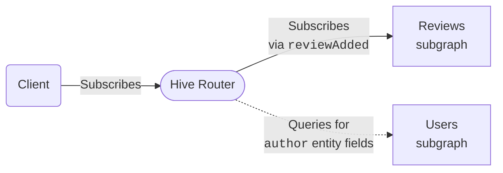

import { Callout } from '#components/callout'
import { Tabs } from '@theguild/components'

# Federated Subscriptions

GraphQL subscriptions enable your clients to receive real-time data. This is essential for
applications that need live updates - like notifications, live chat, stock tickers, collaborative
editing, or IoT dashboards.

Hive Router provides full support for federated subscriptions out of the box, with no additional
configuration required. It works as a drop-in replacement for other federation routers, making it
easy to add real-time capabilities to your federated GraphQL architecture.

## How Subscriptions Work

Consider this subscription query against Hive Router:

```graphql
subscription {
  reviewAdded {
    rating
    body
    author {
      name
    }
  }
}
```

This creates the following data flow:



Your client executes a subscription operation against Hive Router over HTTP using either Server-Sent
Events (SSE) or multipart responses. The router then executes the same subscription against
whichever subgraph defines the requested field - in this case, the Reviews subgraph that provides
the `reviewAdded` field. The router communicates with subgraphs using the same protocols: SSE or
multipart.

When the Reviews subgraph sends new data, the router receives it and forwards it to the client. If
the subscription includes federated entity fields from other subgraphs - like the `author` field
that comes from the Users subgraph in this example - the router automatically resolves those fields
by querying the corresponding subgraphs over HTTP. This allows you to subscribe to data that spans
multiple subgraphs while maintaining a single subscription connection from your client.

## Supported Protocols

Hive Router currently supports two protocols for subscriptions, both for client-to-router and
router-to-subgraph communication:

- [Server-Sent Events (SSE)](#server-sent-events-sse) - A simple, efficient protocol built on
  standard HTTP
- [Incremental Delivery over HTTP](#incremental-delivery) - From the
  [official GraphQL over HTTP spec RFC](https://github.com/graphql/graphql-over-http/blob/main/rfcs/IncrementalDelivery.md).
- [Multipart HTTP](#multipart-http) - Based on
  [Apollo's Multipart HTTP protocol](https://www.apollographql.com/docs/graphos/routing/operations/subscriptions/multipart-protocol)

<Callout type="warning">

[GraphQL over WebSocket](https://github.com/enisdenjo/graphql-ws/blob/master/PROTOCOL.md) and
[HTTP Callback (for subgraphs)](https://www.apollographql.com/docs/graphos/routing/operations/subscriptions/callback-protocol)
support is coming soon. We want to ensure they meet our standards for reliability and performance
before making them generally available.

</Callout>

When dealing with HTTP subscriptions, the router automatically determines which protocol to use
based on the `Accept` header in the request. When subscribing to subgraphs, the router prefers
multipart first, then falls back to SSE.

## Entity Resolution

One of the most powerful features of federated subscriptions is automatic entity resolution. Your
subscription can include fields from multiple subgraphs, and Hive Router handles all the
coordination automatically.

```graphql
subscription {
  reviewAdded {
    # From the reviews subgraph
    id
    body
    rating
    # Entity field from the products subgraph
    product {
      name
      price
    }
    # Entity field from the users subgraph
    author {
      name
      email
    }
  }
}
```

In this example:

- The `reviewAdded` subscription is defined in the **reviews** subgraph
- The `product` fields are resolved from the **products** subgraph
- The `author` fields are resolved from the **users** subgraph

Hive Router intelligently determines the optimal way to resolve these entity fields, querying the
necessary subgraphs as subscription events arrive. This works exactly like entity resolution for
regular queries - no special configuration or considerations needed.

## Server-Sent Events (SSE)

To use SSE, clients should send requests with the following `Accept` header:

```text
Accept: text/event-stream
```

The router will respond with a stream of events implementing
[the "distinct subscriptions mode" of the GraphQL over SSE spec](https://github.com/enisdenjo/graphql-sse/blob/master/PROTOCOL.md#distinct-connections-mode)
.

### Try It

```bash
curl 'http://localhost:4000/graphql' \
  -H 'accept: text/event-stream' \
  --json '{
    "query": "subscription {
      reviewAdded {
        body
        rating
        product {
          name
        }
        author {
          name
        }
      }
    }"
  }'
```

This command creates an SSE connection and keeps it open to receive new subscription data as
server-sent events:

```text
event: next
data: {"data":{"reviewAdded":{"body":"Great product!","rating":5,"product":{"name":"Croissant"},"author":{"name":"Alice"}}}}

event: next
data: {"data":{"reviewAdded":{"body":"Could be better","rating":3,"product":{"name":"Baguette"},"author":{"name":"Bob"}}}}

event: next
data: {"data":{"reviewAdded":{"body":"Excellent quality","rating":5,"product":{"name":"Croissant"},"author":{"name":"Charlie"}}}}

event: complete
```

This example subscription emits three `next` events and then sends a `complete` event to signal the
end of the stream. Notice how the `product` and `author` fields are automatically resolved from
their respective subgraphs.

### EventSource

You can easily subscribe over SSE using the
[browser native `EventSource` interface](https://developer.mozilla.org/en-US/docs/Web/API/EventSource).
It's as simple as:

```ts
const url = new URL('http://localhost:4000/graphql')
url.searchParams.append(
  'query',
  `subscription {
    reviewAdded {
      body
      rating
      product {
        name
      }
      author {
        name
      }
    }
  }`
)

const source = new EventSource(url)

source.addEventListener('next', ({ data }) => {
  console.log(data)
})

source.addEventListener('error', e => {
  console.error(e)
})

source.addEventListener('complete', () => {
  source.close()
})
```

### graphql-sse

We highly recommend using [`graphql-sse`](https://the-guild.dev/graphql/sse), the zero-dependency,
HTTP/1 safe, simple, GraphQL over Server-Sent Events spec client library.

It offers reliable handling of connection management, message parsing, and error handling, as well
as silent retries and exponential backoff for improved resilience.

#### Apollo Client

Please advise the
[Apollo Client integration recipe](https://the-guild.dev/graphql/sse/recipes#with-apollo).

#### Relay

Please advise the [Relay integration recipe](https://the-guild.dev/graphql/sse/recipes#with-relay).

#### urql

Please advise the [urql integration recipe](https://the-guild.dev/graphql/sse/recipes#with-urql).

<Callout type="tip">

urql also supports SSE out of the box! Just make sure to
[enable subscriptions over fetch](https://nearform.com/open-source/urql/docs/advanced/subscriptions/#using-fetch-for-subscriptions).

</Callout>

## Incremental Delivery

Using incremental delivery requires clients to send requests with the following `Accept` header:

```text
Accept: multipart/mixed
```

The router responds with multipart HTTP responses conforming to
[the Offical GraphQL over HTTP Incremental Delivery over HTTP RFC](https://github.com/graphql/graphql-over-http/blob/main/rfcs/IncrementalDelivery.md).

### Apollo Client

<Callout type="info">

Please instead advise the [multipart HTTP example](#apollo-client-2) since Apollo Client supports
multipart HTTP out-of-the-box.

</Callout>

### Relay

[`meros`](https://github.com/maraisr/meros) is a fast utility that makes reading multipart responses
simple. It works in both the browser and Node.js.

Using it with Relay is quite straight forward, here's an example setup:

```npm2yarn
npm install meros
```

```ts
import { meros } from 'meros/browser'
import { GraphQLResponse, Network, Observable, RequestParameters, Variables } from 'relay-runtime'

// Supports both queries/mutations and subscriptions.
function fetchOrSubscribe(operation: RequestParameters, variables: Variables) {
  return Observable.create<GraphQLResponse>(sink => {
    const ctrl = new AbortController()

    ;(async () => {
      const parts = await fetch('http://localhost:4000/graphql', {
        signal: ctrl.signal,
        method: 'POST',
        body: JSON.stringify({
          query: operation.text,
          variables
        }),
        headers: {
          'content-type': 'application/json',
          accept: 'application/json, multipart/mixed'
        }
      }).then(meros)

      if (parts instanceof Response) {
        // query/mutation
        return parts.json()
      }

      // subscription
      for await (const part of parts) {
        sink.next(part)
      }
    })()
      .then(() => sink.complete())
      .catch(error => sink.error(error))

    return () => ctrl.abort()
  })
}

export const network = Network.create(fetchOrSubscribe, fetchOrSubscribe)
```

<Callout type="tip">

Alternatively, you can also use
[`fetch-multipart-graphql`](https://github.com/relay-tools/fetch-multipart-graphql) for Relay
clients to add support incremental delivery over HTTP. It's a library maintained by Relay Tools -
community-built tools for working with Relay.

</Callout>

### urql

<Callout type="info">

urql supports incremental delivery over HTTP out of the box! Just make sure to
[enable subscriptions over fetch](https://nearform.com/open-source/urql/docs/advanced/subscriptions/#using-fetch-for-subscriptions).

</Callout>

## Multipart HTTP

To use multipart responses, clients should send requests with the following `Accept` header:

```text
Accept: multipart/mixed;subscriptionSpec=1.0
```

The router will respond with multipart HTTP responses conforming to
[Apollo's Multipart HTTP protocol](https://www.apollographql.com/docs/graphos/routing/operations/subscriptions/multipart-protocol).

### Try It

```bash
curl 'http://localhost:4000/graphql' \
  -H 'accept: multipart/mixed;subscriptionSpec=1.0' \
  --json '{
    "query": "subscription {
      reviewAdded {
        body
        rating
        product {
          name
        }
        author {
          name
        }
      }
    }"
  }'
```

This command creates an HTTP multipart request and keeps an open connection that receives new
subscription data in response "chunks":

```text
--graphql
content-type: application/json

{}
--graphql
content-type: application/json

{"payload":{"data":{"reviewAdded":{"body":"Great product!","rating":5,"product":{"name":"Croissant"},"author":{"name":"Alice"}}}}}
--graphql
content-type: application/json

{"payload":{"data":{"reviewAdded":{"body":"Could be better","rating":3,"product":{"name":"Baguette"},"author":{"name":"Bob"}}}}}
--graphql
content-type: application/json

{"payload":{"data":{"reviewAdded":{"body":"Excellent quality","rating":5,"product":{"name":"Croissant"},"author":{"name":"Charlie"}}}}}
--graphql--
```

This example subscription emits three events and then closes the connection. Notice how the
`product` and `author` fields are automatically resolved from their respective subgraphs.

### Apollo Client

The required headers are automatically added by Apollo Client.
[Multipart subscriptions are support out-of-the-box.](https://www.apollographql.com/docs/react/data/subscriptions#subscriptions-via-multipart-http)

```npm2yarn
npm install @apollo/client graphql rxjs
```

```ts
import { ApolloClient, HttpLink, InMemoryCache } from '@apollo/client'

const client = new ApolloClient({
  link: new HttpLink({ uri: 'http://localhost:4000/graphql' }),
  cache: new InMemoryCache()
})

client
  .subscribe({
    query: gql`
      subscription {
        reviewAdded {
          body
          rating
          product {
            name
          }
          author {
            name
          }
        }
      }
    `
  })
  .forEach(data => {
    console.log(data)
  })
```

### Relay

We recommend using [Incremental Delivery over HTTP with Relay instead](#relay-1).

### urql

We recommend using [Incremental Delivery over HTTP with urql instead](#urql-1).
